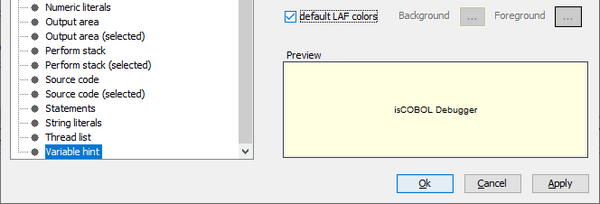

## isCOBOL Debugger

The isCOBOL Debugger has been enhanced in the 2022 R2 release to improve the usability when using different LAFs. These are the features added in the new release:

- colors configured in Debugger can now follow the standard LAF color settings

The debugger’s “Fonts and Colors” window, from the menu’s Settings/Customize option, is where you would set the different fonts and colors for different parts of the Debugger.

In 2022 Release 2, you can set the “default LAF colors”, and the result will be different when running on different operating systems or when running with a different LAF. The colors will then be more coherent, for example the Hint displayed when the mouse is on a data item, will look the same as the Hint displayed for the buttons. The new setting is shown in Figure 6, *Debugger LAF color*.

Figure 6. Debugger LAF color.

- new option -a for Debugger's infostack command to show all available info

The *infostack* is a command that can be used in the command-line to list all paragraphs and programs involved in the stack. With the new option –a, the source file and line number are shown in the output. For example this is the output of the command with the new –a option executed while debugging:

```cobol
+ MAIN [THREAD_BRIDGE] source/THREAD-BRIDGE.cbl:34
 + MAIN [ISCUSTOMER] source/ISCUSTOMER.cbl:265
  + AFTER-ACCEPT [ISCUSTOMER] source/ISCUSTOMER.cbl:291
   + READ-NEXT [ISCUSTOMER] source/ISCUSTOMER.cbl:424
```
