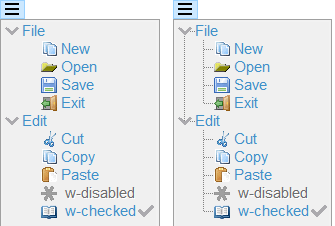

## isCOBOL Runtime

Improvements to library routines and configuration settings have been added to the new isCOBOL runtime:

### Improvements to library routines

Several library routines have been improved in the 2022 R2 release:

- W$MENU library supports a new attribute named "show-lines" to show the lines connecting menu items in the hamburger menu. The following code snippet activates the new attribute:

```cobol
call "W$MENU" using wmenu-set-attribute "show-lines" "yes"
```

The result when running the snippet is shown in in Figure 5, *Show-lines attribute of Hamburger menu*. The menu on the right has the new attribute set to “yes”.

Figure 5. Show-Lines attribute of Hamburger menu.

- C$COPY and C$FSCOPY routines support an additional optional parameter to specify that the indexed file to be copied is encrypted. This works in conjunction with the JISAM file handler by using the same key set in the configuration option *iscobol.file.encryption.key*. The code snippet below shows the usage of the new parameter:

```cobol
call "C$COPY" using src-path, dest-path, "I", 1
call "C$FSCOPY" using src-path, dest-path, 1
```

- WIN$PRINTER library is now more flexible when creating PDF files using the –P PDF flag or saving a PDF file in the Print Preview. With previous releases it was mandatory to CALL the WINPRINT-SET-ATTRIBUTE op-code to set the attribute FONT\_FOLDER or FONT\_FOLDER\_EMBED to embed fonts in the PDF file. In the current release, if these attributes are not set, isCOBOL will search for fonts in the default operating system’s font folder: C:\\Windows\\Fonts on Windows, /usr/share/fonts on Linux and /Library/Fonts on MacOS, to embed fonts and use the Identity-H encoding in the generated PDF file.

### New configurations

New configuration settings have been added in this release:

- *iscobol.file.index.open_hook=ProgramName* can be used to specify a hook program to be called before a file is opened, and allows the file path or file handler class to be modified on the fly. The ProgramName must declare two parameters received in linkage section as follows:

```cobol
linkage section.
77 file-path pic x(300).
77 file-class pic x(300).
procedure division using file-path, file-class.
```

The hook program is executed just before the file is opened and, if necessary, can update the value of the two parameters to change the file path or the file handler. This flexible solution can be used, for example, to easily migrate programs from a Fat-Client to a Thin-Client architecture, where the “local working files” are not on the client PC, but are located on the server, and files might have to be kept separate for different users.

- *iscobol.floating_point_format=ibm_hfp* to store data-items with usage 'float' or 'double' using the IBM hexadecimal floating-point format (known also as HFP by IBM), instead of the default “ieee_754”, the technical standard for floating-point arithmetic established in 1985 by the Institute of Electrical and Electronics Engineers (IEEE). In comparison to IEEE 754 floating point, the HFP by IBM format has a longer coefficient, and a shorter exponent.
- *iscobol.gui.nested_embedded_proc_check=true* to check for nested accepts in embedded procedures. When this configuration option is set, a specific exception is thrown. This helps the developer easily identify and correct any nested accepts found in the code.
- *iscobol.file.index.ctshmemdir=directory* to set the sharedmem directory for the CTREEJ file handler. On Unix platforms the c-treeRTG server shares a directory with the c-treeRTG clients when the communication is performed using the shared memory protocol. When using multiple c-treeRTG servers, it’s important to configure the SHMEM_DIRECTORY in each server’s ctsrvr.cfg configuration files, and set the same value in this new isCOBOL configuration setting, so that every server uses a separate folder for SHAREMEM communication.
- *iscobol.file.index.endiancheck=false* to skip the byte endianness check made by CTREEJ file handler during connection. By default, the check is made to ensure that the byte endianness of both client and server is the same. In cases where this check is not necessary, such as when accessing files not containing native numeric data types, the check can be relaxed so the connection can succeed.

Additionally, it’s now possible to configure the exception values returned when the user just presses a letter without any additional special key. This helps in situations such as when accepting a screen containing only controls not used for editing, for example pushbuttons, allowing the user to quickly choose an option by just pressing a letter without the need to press it in combination with Alt or Ctrl. For example, configuring:

```cobol
iscobol.key.a=exception=101
iscobol.key.b=exception=102
```

when the user presses the “a” key, the program intercepts the exception-value 101, and 102 is received when pressing the “b” key.
