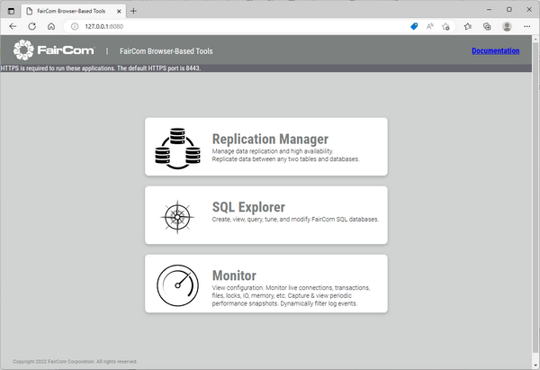
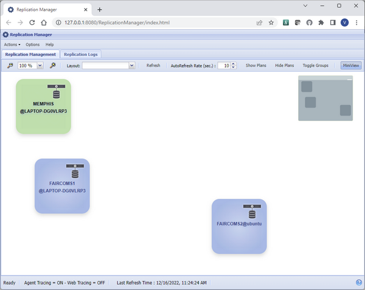
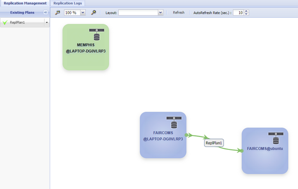
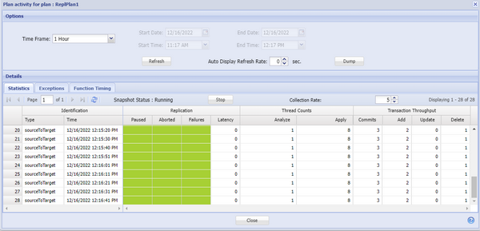

## C-Tree Replication Manager

The current v3.0.2 release supports a new product named Replication Manager. It is a web GUI tool you can use to easily configure replication between different c-tree servers. It can also be used to monitor the replication status. The Replication Manager, also known as Memphis, can be installed on the same server as c-tree server or on a different server. Memphis automatically detects the c-tree servers running that are configured to be managed by the replication manager.

After starting the executable file named “Memphis” and the c-treeRTG servers in the network, you can open a browser and enter the URL: [http://127.0.0.1:8080](http://127.0.0.1:8080) or [https://127.0.0.1:8443](https://127.0.0.1:8443 ) to use the HTTPS protocol and see the main menu as shown in Figure 7, *Memphis web menu*.

Figure 7. Memphis web menu.

Clicking on the Replication Manager button opens a new browser tab with the Replication Manager application at URL [http://127.0.0.1:8080/ReplicationManager/index.html](http://127.0.0.1:8080/ReplicationManager/index.html) and the list of available c-tree servers is shown as depicted in Figure 8, *Replication Manager View*.

Figure 8. Replication Manager View.

The other links shown in Figure 7, *Memphis web menu* above can be used to open the SQL Explorer and Monitor web applications. These are the same as the existing c-tree web-tools and are now integrated in Memphis.

In the Replication Manager’s application, you can drag a “Source” server over a “Target” server to create a Replication plan, based on a Publication where you can define if the replication is for SQL tables, ISAM files or both. You can also filter ISAM files included in specific folders that need to be included or excluded from the replication. The last steps of the configuration process are: Subscribe the Publication, choosing if the replication is unidirectional or bidirectional, and Deploy the replication plan. After the Deploy, if the replication has started correctly, the line connecting the two c-tree servers turns green as shown in Figure 9, *Replication Plan deployed*, where the data on the FAIRCOMS server running on Windows are replicated on the FAIRCOMS server running on Ubuntu Linux.

Figure 9. Replication Plan deployed.

An overview of the current replication status and total amount of commits, records added, updated or deleted, can be activated from the Activity menu item of the pop-up menu of the deployed plan, as shown in Figure 10, *Replication Activity*.

Figure 10. Replication Activity.

