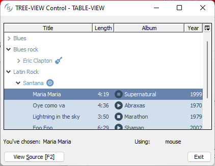
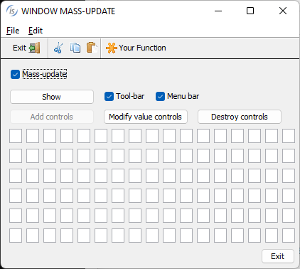

## GUI enhancements

Improvements to GUI controls have been implemented in this release, especially in the tree-view control and window container to optimize screen refresh.

### Enhancements on tree-view

The tree-view control now supports the VPADDING property to affect the height of the items, indicating extra vertical space to be applied to each item. The value of this property is expressed as a percentage of the control’s font, like in the grid control. This property is supported by both the standard tree-view without columns and the Table-View with columns.

In the tree-view with Table-View style, the ability to display icons in the different columns through the BITMAP-NUMBER and BITMAP-TRAILING properties in the column identified by the X property is now supported.

The following code snippet:

```cobol
          03  tree-table tree-view table-view
              bitmap-handle hBmpAC
              bitmap-width  16
              ...
              vpadding 50
           ...
           modify tree-table parent tv-item-parent item-to-add rec-grid 
                             giving tv-item-child  has-children 1
                             x 1 bitmap-number wrk-num-bmp bitmap-trailing 1
           modify tree-table parent tv-item-child  item-to-add rec-grid 
                             giving tv-item has-children 0
                             x 1 bitmap-number 0
                             x 3 bitmap-number wrk-num-bmp-2 
```

declares a tree-view control with table-view style and a bitmap strip during the loading.

Different icons are set on different items. Icons are set on the first column after the text and on the third column before the text since bitmap-trailing is not set, resulting in the default value 0 to be used. The result of the code is shown in Figure 12, *Table-View with icons*.

Figure 12. Table-View with icons.



### Window optimization

Typical graphical applications display complex forms, potentially containing hundreds of controls. Such applications can suffer for sub-optimal screen refresh performance, depending of the performed operation or implementation details.

Potential problematic areas include, for example, windows composed of multiple screens, windows where individual controls are created dynamically using DISPLAY statements, and windows that are destroyed and then re-created, causing content such as menu bar, tool-bar and ribbon controls to be recreated.

In these situations, depending on the device and monitor refresh performance, or network speed when running in ThinClient or WebClient, a screen refresh could be aesthetically unappealing and perform poorly.

To avoid this, the MASS-UPDATE property, already supported on controls such as grid, tree-view, list-box and combo-box, can be applied to a window to group multiple user interface updates in a single refresh. Just set MASS-UPDATE to 1 before a large UI refresh and set again MASS-UPDATE to 0 when the all updates are completed. All the changes are applied instantly, resulting in higher performance and a smoother and more pleasing user experience.

MASS-UPDATE on controls should still be used to ensure best performance.

The following code snippet take advantage of the new implementation:

```cobol
           modify hWin mass-update 1
           destroy Mask
           perform DESTROY-MENU
           perform DESTROY-TOOLBAR
           perform SHOW-MENU
           perform DISPLAY-TOOLBAR
           display Mask
           perform until ...
           ...
              display entry-field handle ef-handle(idx)
                      line w-d-line col w-d-col size 3 cells
           end-perform
           modify pb-add-control     enabled e-pb-add-control 
           modify pb-modify-control  enabled e-pb-modify-control 
           modify pb-destroy-control enabled e-pb-destroy-control 
           modify hWin mass-update 0
```

The result of the code is shown in Figure 13, *Mass-update on window*. When debugging the program, it’s possible to note that after stepping on the “modify hWin mass-update 1”, all the statements that affect controls do not refresh the screen, and only after executing “modify hWin mass-update 0” the screen is fully refreshed.

Figure 13. Mass-update on window.


