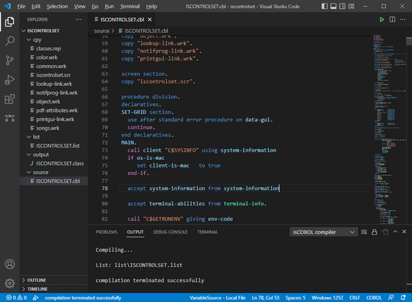
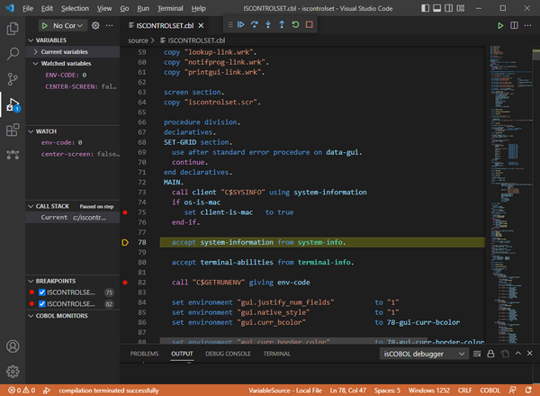

## Visual Studio Code

Visual Studio Code, also known as VS Code, is a source-code editor made by Microsoft for Windows, Linux and macOS. It is very popular and customizable using extensions. Veryant isCOBOL Extension for Visual Studio Code allows COBOL developers to create and manage isCOBOL projects, edit sources, and run and debug isCOBOL programs. Settings are available to configure the location of the isCOBOL SDK, the compiler options used when compiling, the run options, the editor and much more.

These settings can be global, which are valid for any project, or project-specific.

The Veryant isCOBOL Extension provides several useful new commands, accessible using the shortcut key Shift-Ctrl-P on Windows and Linux and Shift-Cmd-P on MacOS. COBOL developers can use these commands to create new isCOBOL projects, create new source and copybook files with a default template and useful source code helper functions, compile source code, and run debugger-specific commands.

When compiled in debug mode, the VS code debugger can be used to debug isCOBOL programs, supporting common debugging features such as stepping in code, setting breakpoints, evaluating variables and setting watches.

Debugging is supported starting from isCOBOL 2023 R1, while editing is supported for all isCOBOL versions.

As shown Figure 1, *Editing in the Veryant isCOBOL Extension*, the COBOL source is edited and compiled in VS Code. Figure 2, *Debugging in the Veryant isCOBOL Extension*, shows the isCOBOL Debugger is in action.

Figure 1. Editing in the Veryant isCOBOL Extension.

Figure 2. Debugging in the Veryant isCOBOL Extension.

