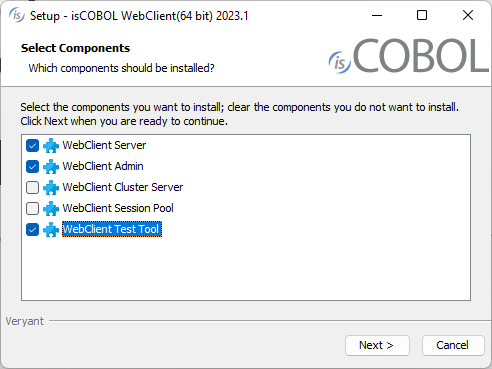
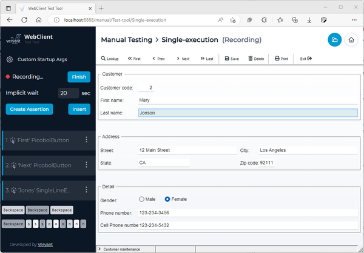
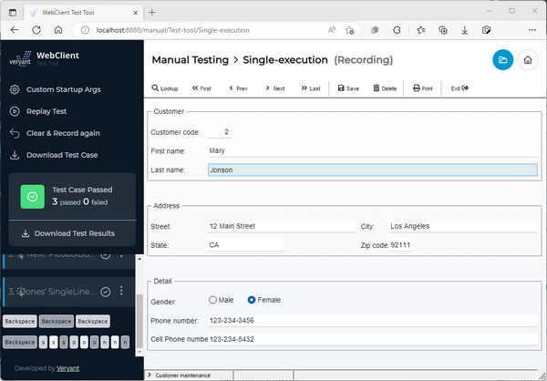
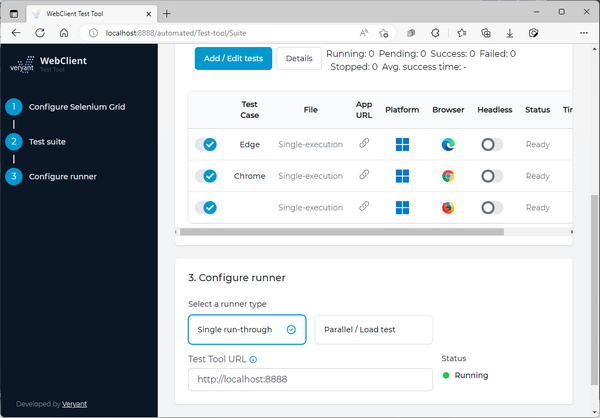

## WebClient Test Tool

The isCOBOL WebClient installer contains a new product named Test Tool. With Test Tool you can interactively create test cases for your isCOBOL character or graphical application running in WebClient. Test Tool is a web application that lets you record a test case, consisting of a series of mouse clicks and keyboard events a user performs when running an isCOBOL application, then set assertions on expected results and later playing back the events and checking that the application still works as intended. Multiple tests can be automated using Selenium Grid.

As shown in Figure 3, *WebClient Test Tool installer*, the new product has been selected to be installed along with the WebClient Server and Admin.

Figure 3. WebClient Test Tool installer



WebClient Test Tool is a separate service that can be installed on the same server where WebClient is running or on a different server. To start the service in foreground mode, issue the command:

```cobol
webcclient-testtool
```

To run the Windows service or Linux daemon in the background, the command is:

```cobol
webclient-testtool -start
```

The Test Tool application can be reached using a web browser and navigating to the URL [http://localhost:8888/](http://localhost:8888/).

From the html interface you can create test projects and start recording the actions taken when using the isCOBOL program running in WebClient. Every time a mouse click in the application is detected a new assertion is created. An assertion is a set of properties that will be validated in the test case, like component type, value, path, etc.

As shown in Figure 4, *WebClient Test Tool recording*, the right panel shows the WebClient application running and the left panel shows the list of recorded actions.

Figure 4. WebClient Test Tool recording.



When all the needed Assertion steps are created, click the Finish button, and the recorded actions are stored in a file in the project folder. The saved tests can be downloaded or played back to verify that changes in the isCOBOL application work as intended. Assertions are validated in the toolbox. Playback can be stopped, paused, and run step by step. Assertions can be edited or added, and breakpoints can be set just like when using a debugger.

Figure 5, *WebClient Test Tool result*, shows the isCOBOL program running in WebClient, and the results of the performed test cases.

Figure 5. WebClient Test Tool result.



A test suite is a collection of tests that can be grouped to automate test cases.

A suite is a configuration file where you define which test cases to run and set options to be used. Automated test cases require Selenium Grid, a smart proxy server that makes it easy to run tests in parallel on multiple machines. This is done by routing commands to remote web browser instances, where one server acts as the hub. This hub routes test commands that are in JSON format to multiple registered Grid nodes.

A Selenium Grid can be set up either in your local environment or as a third-party service. To set the Selenium Grid in the WebClient Test Tool, set the URL of the running Selenium Hub, for example: [http://localhost:4444](http://localhost:4444). After the connection is validated, choose the platform and browser based on the availability of the environment on Selenium nodes. Finally, you can choose a “single run-through” or a “parallel run”. The first option executes test cases one-by-one, one instance at a time. The second option can run tests in parallel, and you can set the number of instances you want to run at the same time or after a timeout set in seconds.

As shown in Figure 6, *WebClient Test Tool Suite with Selenium*, the suite is ready to be executed on different browsers.

Figure 6. WebClient Test Tool Suite with Selenium.



When Selenium is used with WebClient Test Tool, it also provides a simple REST API to execute a test suite with one or more tests from an external application. A POST request can be sent to [http://localhost:8888/rest/runTest](http://localhost:8888/rest/runTest), setting the Content-Type header to "application/json" with the following body:

```cobol
{
  "parallel": false,
  "maxRunningParallel": 1,
  "rampUpPeriod": 1,
  "runCount": 1,
  "testCaseParameters": [{
    "project": "project 1",
    "file": "test 1",
    "name": "Test",
    "webswingAppUrl": "http://localhost:8080/isapplication",
    "webswingUsername": "admin",
    "webswingPassword": "admin",
    "platform": "WINDOWS",
    "browser": "chrome",
    "headless": false,
    "enabled": true
  }]
}
```
