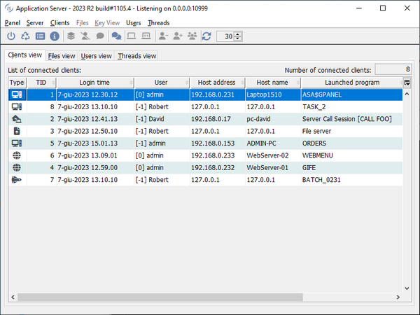

## Additional improvements

isCOBOL 2023 R2 release contains additional improvements in the DatabaseBridge, EIS products and in the Utilities.

### Database bridge

EDBI routines for Microsoft SQL Server now map the COBOL file’s RECORD KEY to a PRIMARY KEY instead of a UNIQUE INDEX. Using a PRIMARY KEY instead of a UNIQUE INDEX provides a more standard SQL code.

In addition, a new compiler property iscobol.compiler.easydb.not\_null\_columns=true (or using the new -nn option on the edbiis executable command) insures the generated EDBI routines will add the NOT NULL clause to all fields when creating the table. This will force external SQL clients to set all the fields when they insert or update records.

### HTTPHandler class

A new method in HTTPHandler class has been added to pass a custom mime type to the displayText method:

```cobol
       void displayText( text, mimetype )
```

Now you can pass “text/xml” or “text/json” instead of the default “text/plain” MIME type. This is useful if the COBOL program creates the json or xml string without using a structure declared with the IS IDENTIFIED clause.

### Utilities

New configurations have been added to customize the font used by different utilities:

- *iscobol.as.panel.custom_font=<\name>-<\size>* to set the font used by isCOBOL Server Panel
- *iscobol.jdbc2fd.custom_font=<\name>-<\size>* to set the font used by JDBC2FD utility
- *iscobol.isl.custom_font=<\name>-<\size>* to set the font used by ISL utility
- *iscobol.ismigrate.custom_font=<\name>-<\size>* to set the font used by ISMIGRATE utility

In addition, the icons used in isCOBOL utilities have been updated to use Font Awesome icons, providing a more modern look and better integration when running them in the web via WebClient. For example, Figure 10, *New icons in isCOBOL Panel*, shows the new look used by isCOBOL Panel.

Figure 10. New icons in isCOBOL Panel.


