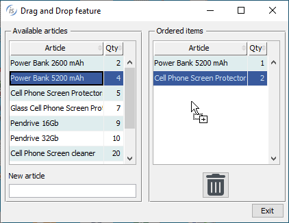
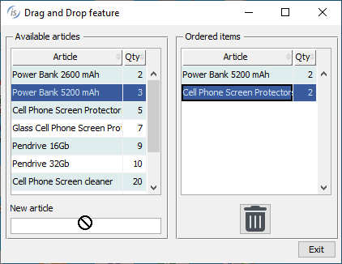
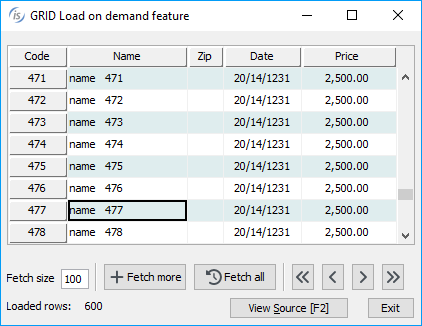
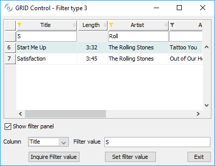

## GUI enhancements

Several improvements to graphical user interface components have been implemented in this release, providing the ability to use drag-and-drop actions on GUI controls, enhancing the grid control with new properties and events and additional capabilities in images integration.

### Drag-and-Drop support

In computer graphical user interfaces, drag and drop is a pointing device gesture in which the user selects a virtual object by "grabbing" it and dragging it to a different location or onto another virtual object. The basic sequence involved in drag and drop is:

1. Move the pointer to the object.
2. Press and hold down the button on the mouse or other pointing device to "grab" the object.
3. "Drag" the object to the desired location by moving the pointer to that location.
4. "Drop" the object by releasing the button.

isCOBOL compiler now supports a new property on most controls named *drag-mode* that allows you to specify which kind of action is enabled. If the property is not set, the default value 0 is assumed, and no actions are enabled. To enable actions the following values can be used:

1 = dragging action is enabled
2 = dropping action is enabled
3 = both dragging and dropping actions are enabled

When the drag action is enabled, the control receives a new event named MSG-DRAG and when the drop action is enabled, the control receives a new event named MSG-DROP.

Currently the controls that fully support this property are: BITMAP, CHECK-BOX, COMBO-BOX, DATE-ENTRY, ENTRY-FIELD, GRID, LABEL, LIST-BOX, PUSH-BUTTON, RADIO-BUTTON, TREE-VIEW. 

For example, a screen section defined as:

```cobol
          03 gd-article grid ...
             drag-mode 3
             event GD-ARTICLE-EVENT.
          03 gd-order grid ...
             drag-mode 3
             event GD-ORDER-EVENT.
          03 ef-article entry-field ...
             drag-mode 1
             event EF-ARTICLE-EVENT.
          03 pb-delete push-button ...
             drag-mode 2
             event PD-DELETE-EVENT.
```

contains 2 grids with drag and drop enabled, an entry-field with just dragging enabled and a push-button with just dropping enabled. In this example, a row from a grid can be moved to another grid by dragging it from one grid to the other, and the number in the Quantity column can be increased when dropping an existing row into the target grid.

The event procedure shown below handles the logic of these actions by managing the two new events:

```cobol
       GD-ARTICLE-EVENT.
           evaluate event-type
           when MSG-DRAG 
                inquire gd-article(event-data-2 1) cell-data gdr-article
                ...
           when MSG-DROP
                ...
                modify gd-article(idx 2) cell-data gdr-qty
           end-evaluate.
       EF-ARTICLE-EVENT.
           if event-type = MSG-DRAG 
              inquire ef-article value ef-dragged-element
              modify ef-article cursor -1
              set drag-from-ef-article to true
           end-if.
       PD-DELETE-EVENT.
           if event-type = MSG-DROP
              if drag-from-gd-order and event-data-2 > 1
                 perform DROP-TO-PB-DEL
              end-if
           end-if.
```

As shown in Figure 1, *Drag allowed*, the mouse shows the plus icon to inform the user that it’s possible to drop the content being dragged. In Figure 2, *Drag prohibited*, the mouse shows the deny icon to imply that it’s not possible to drop the dragged content on the control. Both screenshots were taken from running the installed sample for this new feature that contains the code shown in the previous snippets.

Figure 1. Drag allowed.



Figure 2. Drag prohibited.



### Grid enhancements

The grid control has been enhanced in 2023 R2 to support the load-on-demand feature used to dynamically load content as the user scrolls down in the grid. This approach is beneficial when a grid contains a large number of rows by loading a smaller amount at a time thus reducing the time and resources required to fetch the data.

A grid loaded with the load-on-demand feature is initially filled with a given number of records for fast initial loading, and as the user scrolls down in the grid the new event MSG-LOAD-ON-DEMAND is fired and the application can respond by loading additional rows seamlessly, reducing the application load and delivering a smoother experience for the user.

A specific example is installed in the sample\issamples\s-gui folder, and the following code is a snippet taken from GRID-ON-DEMAND.cbl source:

```cobol
          03 gd grid ...
             lod-threshold 80
             event GD-EVT.
```

This grid definition shows the new property lod-threshold (Load-On-Demand threshold) used to specify the percentage of scrolling in the grid that triggers the MSG-LOAD-ON-DEMAND event. When the user scrolls past 80% of the initially loaded records, the event is fired.

The code snippet below shows the event procedure paragraph that manages the response logic for the new event:

```cobol
       GD-EVT.
           evaluate event-type
           when MSG-LOAD-ON-DEMAND
                perform fetch-size times
                   ...
                   modify gd record-to-add gd-rec
                end-perform
           end-evaluate.
```

In Figure 3, *Load on demand feature*, the program in execution shows the grid loaded during scroll-down.

Figure 3. Load on demand feature.



A new filter type has been added to enable editing the value for filters in selected columns. Using an entry field instead of a check list-box for a filter can be beneficial when the content of a column contains many different values, making a list too long to prove useful. The new filter is declared using the value 3 in the existing property FILTER-TYPES. It can be also mixed with previous types, making it possible to have specific filter types for each column. The panel with the filters’ entry-fields is shown between the heading line and the first grid line when the user clicks on the funnel icon.

There are also two new properties that can be used with the inquire or modify statements:

- *filter-panel* to hide the panel with fields if set to 0 (default 1)
- *column-filter* to save and restore the column filter value

The following snippet shows how the properties can be used:

```cobol
           modify gd(1, num-col) column-filter wrk-filter
           modify gd filter-panel 0
```

The following code snippet:

```cobol
       03 gd grid ...
             filterable-columns
             filter-types (0, 3, 0, 3, 3, 2, 3, 1).
```

declares a grid with the new filter type used on columns 2, 4, 5 and 7. The result of the program in execution is shown in Figure 4, *New filter type in grid*.

Figure 4. New filter type in grid



A new property named CELL-SECURE can now be used in MODIFY and INQUIRE statements to manage the data in the cell as an entry-field with SECURE style. This is necessary in password fields that need to have the “hide/show” behavior dynamically. When the property is set to 1, the cell identified by Y and X coordinates assume the secure feature, making the column shown as asterisks “*****”.

This is a code snippet to set the cell-secure in the cell of row 3 and column 2 and inquire the same property in the cell of row 5 and column 2:

```cobol
           modify  gd(2, 2) cell-secure 1
           inquire gd(5, 2) cell-secure w-secure
```

### Image improvements

The bitmap control now supports two new properties that can be used with the INQUIRE statement to retrieve the raw image dimensions:

- *bitmap-raw-height* returns the height of the image in pixels
- *bitmap-raw-width* returns the width of the image in pixels

These values are also returned by WIMAGESIZEroutine,butinsteadofpassingthehandleofanimageloadedwithWBITMAP they can be inquired directly from the bitmap control.

This is a code snippet that shows how to use the new properties:

```cobol
           inquire bmp-prod bitmap-raw-height wraw-height
           inquire bmp-prod bitmap-raw-width  wraw-width
```

These properties are useful when images are loaded dynamically into fixed-size controls. The program can check to see if the loaded image is larger than the control’s size, and apply scaling accordingly to ensure that the whole image is visible.

The WSCALE routine has been improved by supporting a new value named WSCALE-RESIZE-NONE in the scaleMode parameter, allowing the program to create a new image with different dimensions from the original one, but without scaling it. In conjunction with the scaleAlign parameter, it can be used to align the resulting image as needed.
This is a code snippet that uses the new parameter value in the routine:

```cobol
           move 50                      to wrk-cells-newWidth
           move 18                      to wrk-cells-newHeight
           move WSCALE-RESIZE-NONE      to wrk-scale-mode
           move WSCALE-AL-MIDDLE-CENTER to wrk-scale-mode
           call "WSCALE" using h-bitmap 

                                wrk-cells-newWidth 

                                wrk-cells-newHeight

                                hWin 

                                wrk-scale-mode

                                wrk-scale-align

                         giving h-bitmap-scaled
```
