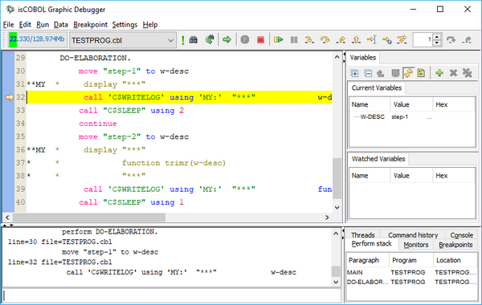
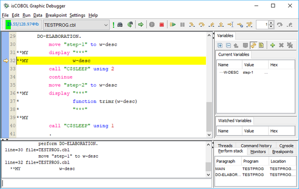

## isCOBOL Compiler

The isCOBOL 2023 R2 compiler includes new compiler options to simplify the migration from other COBOL dialects and other improvements.

### Improved Compatibility with other COBOLs

In this release, two new compiler options have been added to increase compatibility with other COBOL dialects.

The new -ccmf option enables MicroFocus compatibility in numeric literal parameters passed in a CALL statement. For example, in the following code snippet:

```cobol
           CALL "PROGB" USING BY VALUE 123
```

the numeric parameter 123 is passed as if it is in a usage display variable data item PIC 9(3) that uses 3 bytes if the option is not used. Instead, using the new compiler option, the parameter is passed as a signed numeric item USAGE BINARY, as if it is a PIC S9(9) BINARY that uses 4 bytes.

This option is useful when the called program does not implement dynamic management of parameters, for example calling the C$DARG and C$PARAMSIZE library routines to determine what kind of parameters have been passed and how many bytes are received from the calling program.

The new -cmc option allows you to assume WITH CONVERT in every applicable MOVE. This option helps in migrations from Cobol-IT where a move like:

```cobol
           MOVE VARX TO VARNUM

```

where variables are defined as different pictures/size, such as:

```cobol
       01  VARX   PIC X(6).
       01  VARNUM PIC 9(3).
```

and the VARX data item contains “123.00”, with the option enabled, the move statement will set the VARNUM data item to 123. In other words, the MOVE from alphanumeric to numeric data item is treated as if it was written with the WITH CONVERT clause:

```cobol
           MOVE VARX TO VARNUM WITH CONVERT
```

### Other improvements

The current list of compiler options set by default when compiling, to ensure better performance and compatibility, are: -b -cghv -g -oe.

If compiling with the -cp option to enable full support of C pointers, the -m1 option is added to the default options as well.

The compiler now supports the “-no” prefix before the option name on the command line to remove an option set by default. For example, if a program needs to be compiled without the default –b option, use the command line:

```cobol
iscc -no-b -d PROGNAME.cbl
```

To check which compiler options have been used at compile time on an existing .class, you can run the command:

```cobol
iscrun -info PROGNAME
```

which will print the following output:

*C:/myapp/classes/PROGNAME.class: compiled with isCOBOL build #1105, minimum required #1103, debug*

*Compile flags: -g -oe –cghv -d*

*Compiled on: June 16, 2023 11:30:23 AM*

Starting from 2023R2, the compilation date and time is added to the above list of information.

The same information shown above can also be retrieved at runtime using the new library function compiled-info, and the following code:

```cobol
           MOVE $COMPILED-INFO TO VARX

```

or:

```cobol
           MOVE FUNCTION COMPILED-INFO TO VARX
```

will set the VARX variable to the same data shown by running the iscrun -info command.

The new *-classinfo* option has been added to the *display* Debugger command to display the same metadata, i.e.:

```cobol
display -classinfo
```

A new compiler configuration option named *iscobol.compiler.debug.replaced_source* has been added to determine what code will be shown in the Debugger when debugging a program.

When compiling with the configuration set to “true” (default), the replaced source will be shown by the Debugger.

When compiling with the configuration set to “false”, the original source will be shown by the Debugger.

This option can be useful when the compiled source is modified by an external tool before being compiled, for example when using the integrated PreProcessor by setting the configuration iscobol.compiler.custompreproc or iscobol.compiler.regexp that replaces the source code using regular expression rules.

For example, compiling the sample installed in the “sample\compiler-pre-process\custom-log” folder without the new compiler configuration, the default value true is assumed, and the Debugger will show the code in Figure 8, *Debugger with replaced code*. If compiling using *iscobol.compiler.debug.replaced_source=false* the Debugger will show the code in in Figure 9, *Debugger with original code*.

Figure 8. Debugger with replaced code.



Figure 9. Debugger with original code.


