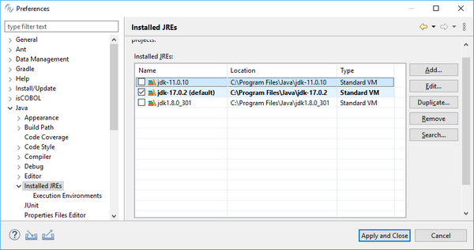
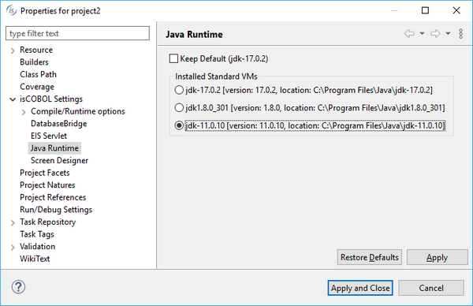
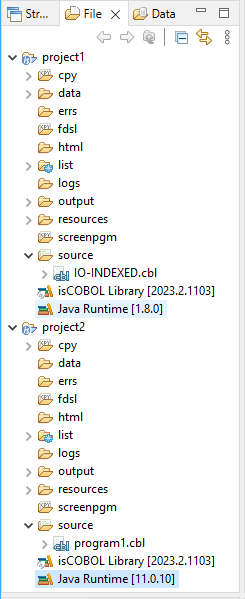

## isCOBOL IDE

The isCOBOL IDE 2023 R2 includes a new feature that allows you to run or debug programs using specific JRE versions for each project.

### Configuring JRE in IDE projects

By default, isCOBOL IDE runs with the Java JDK chosen during installation, with version 11 being the minimum allowed version. When compiling, the -source and -target options are set to 1.8 by default, making the compiled .class runnable starting from JRE 1.8.

Applications may need to be run using different Java releases for any number of reasons, for example when using Object Oriented Programming with dependencies on classes compiled with specific JDK releases. Different Java distributions (for example Oracle JDK or OpenJDK) can be selected as well.

To fully support the execution of Cobol applications with different Java releases, isCOBOL IDE 2023R2 reads the list of installed JREs in Eclipse’s preference page, as shown in the Figure 5, *Preferences of Installed JREs*.

In the isCOBOL Settings / Java Runtime properties page, it’s now possible to specify one of the installed JREs to be used when running the project’s programs, as shown in Figure 6, *Java Runtime set on project properties*.

Each project can use its own Java version or distribution.

Figure 5. Preferences of Installed JREs

Figure 6. Java Runtime set on project properties

The chosen version of the Java runtime is shown in the workspace as the last item of each project tree after the isCOBOL library release. For example, in Figure 7, *Java Runtime version* shows project1 that is configured to run programs with Java 1.8.0, while project2 is configured to run programs with Java 11.0.10.

Figure 7. Java Runtime version

