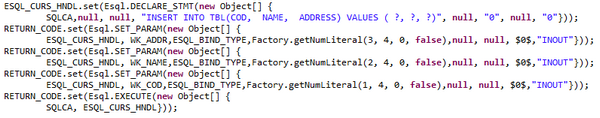
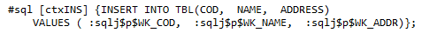
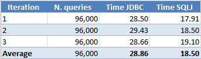

## ESQL enhancements

IsCOBOL 2024 R1 contains many enhancements in the ESQL area. Use SQLJ code to improve performances in batch elaborations with a new compiler option. Simplify the work to move a COBOL application from one database to another with new configurations and interfaces. In addition, the compatibility with DB2prep has been improved.

### SQLJ support

The isCOBOL compiler can now generate SQLJ code to be used instead of standard JDBC APIs on Oracle and DB2 databases. SQL is a non-procedural language for defining and manipulating data in relational databases. SQLJ is a language that embeds static SQL in Java in a way that is compatible with Java's design philosophy. SQLJ does syntax-checking of the embedded SQL, type-checking to assure that the data exchanged between Java and SQL have compatible types and proper type conversions, and schema-checking to assure congruence between SQL constructs and the database schema.

Using SQLJ instead of standard JDBC APIs on Oracle and DB2 databases provides better performance of the static SQL, including every DML query that is not prepared. To generate program classes that manage ESQL via SQLJ instead of standard JDBC APIs, add the -sqlj option to your compiler command line. For a correct result the “sqlj” command (the SQLJ translator) must be available in the Path environment. To see the difference between standard JDBC APIs and SQLJ, you can use -jj -jc in the compiler command line and look at the intermediate java source.

A query like this:

```cobol
           EXEC SQL
              INSERT INTO TBL (COD, NAME, ADDRESS) 
                     VALUES (:WK-COD, :WK-NAME, :WK-ADDR)
           END-EXEC.
```

is translated to a call to the isCOBOL’s ESQLRuntime based on JDBC APIs as:

When the -sqlj switch is used the query is translated to this code:

To compile and run the isCOBOL’s ESQL sample on DB2 with SQLJ, follow these steps:

1. Compile the program with the -sqlj option, e.g.:

```cobol
iscc -sqlj ESQL-SAMPLE.cbl
```

2. Bind the generated profile file to the database, e.g.

```cobol
db2profc -url " jdbc:db2://localhost:50000/SAMPLE" -user db2inst1 -password secret ESQL_SAMPLE_SJProfile0.ser
```

3. Run the program:

```cobol
iscrun ESQL_SAMPLE
```

A table of performance gains is shown in Figure 3, Comparing JDBC vs SQLJ, where the same program is executed with both the standard JDBC and SQLJ. The test was run in 64-bit Ubuntu Linux on an Intel Core i5 Processor 4440+ clocked at 3.10 GHz with 16 GB of RAM, using Oracle JDK 1.8.0_381 and IBM DB2 11.5. Times are expressed in seconds. The COBOL program reads 96,000 rows from a table using single SELECT statements:

```cobol
           EXEC SQL
              SELECT field-1, field-2, ..., field-n 
                INTO :hostvar-1, :hostvar-2, ...,  :hostvar-n
                FROM table-name WHERE id = ? 
           END-EXEC
```

The test has been repeated 3 times to get an average time.

**Figure 3.** Comparing JDBC vs SQLJ.



### Move to a different Database

When COBOL application written with ESQL code for a specific RDBMS need to be migrated to a different RDBMS, developers face the challenge of adjusting the SQL code that may have been written to support a specific RDBMS and is not compatible with another RDBMS. isCOBOL 2024 R1 can ease the migration with both the improved PreProcessor, which performs manipulation of Embedded SQL statements enclosed in the “EXEC-SQL” and “END-EXEC” statements, and the new configuration options and interfaces to customize handling of ESQL by the runtime framework.

The first step is to write a PreProcessor class using either Java or COBOL, and use it during the compilation to adjust the static ESQL statements used in the source. To use the PreProcessor it’s necessary to add the PreProcessor class name in the compiler configuration file.

For example, the query:

```cobol
          EXEC SQL
             SELECT CHAR(CURRENT DATE, ISO)
                    INTO :wrk-date
                    FROM SYSIBM.SYSDUMMY1
          END-EXEC.
```

uses valid syntax in DB2 to retrieve the current date, but it is not supported by Oracle. The PreProcessor needs to change the code to:

```cobol
          EXEC SQL                                                      
             SELECT TO_CHAR(CURRENT_DATE, 'YYYY-MM-DD')                 
                    INTO :wrk-date                                      
                    FROM DUAL                                           
          END-EXEC.  
```

The new query can run on Oracle using its built-in TO_CHAR function instead of DB2’s CHAR, and the parameters passed to the function are different. Also the FROM clause needs to be changed to be supported by Oracle. The PreProcessor code needed to perform this change is provided as a sample in the isCOBOL installation.

The second step is to manage the same syntax replacement for dynamically generated queries, since those can’t be identified in the source or are not present in the source code at all. A new configuration named iscobol.esql.prepare_handler has been implemented to allow developers to provide a class that customizes the PREPARED ESQL statements before they are executed. For example, the following code:

```cobol
       MOVE "SELECT CHAR(CURRENT DATE, ISO) FROM SYSIBM.SYSDUMMY1"  
         TO WRK-QUERY.                                           
       EXEC SQL                                                     
          PREPARE CMD FROM :wrk-query                               
       END-EXEC.   
```

executes the same query shown before but with the PREPARE statement. It will be intercepted by the class that implements the new interface, which can then perform the needed changes to be compatible to the target RDBMS. The class must implement the interface com.iscobol.rts.EsqlPrepareHandler, which requires the following method to be defined:

```cobol
public void queryDecoder(CobolVar query)

```

The queryDecoder method allows you to alter the SQL query text of a prepared ESQL statement before it is executed and the same logic implemented in the previous PreProcessor class can be reused. To have your class be automatically called after each ESQL PREPARE, set *iscobol.esql.prepare_handler=\<classname>* in the configuration. The installed sample also demonstrates how to use this configuration in conjunction with the PreProcessor code.

Different RDBMs can return different status codes, so the last step involves the configuration of SQLCA fields to map the error codes to common codes. The new interface com.iscobol.rts.EsqlSqlcaHandler can ease this task by implementing the following method:

```cobol
public void sqlcaDecoder(SQLException ex, 
                         CobolVar sqlcode, 
                         CobolVar sqlstate, 
                         CobolVar sqlerrmc)
```

You can use this method to set the SQLCODE, SQLSTATE and SQLERRMC fields before they’re returned to the COBOL program. The method receives as input the instance of java.sql.SQLException that was raised then running the query, and you can inquire to get the error details and set SQLCA fields accordingly.

To have your class automatically called after each ESQL error, set *iscobol.esql.sqlca_handler=\<classname>* in the configuration.

This feature integrates the existing iscobol.esql.sqlcode.= configuration setting.

With *iscobol.esql.sqlcode.=\<new-value>* you can map a SQLCODE value to another, creating a compatibility between different databases. But *iscobol.esql.sqlcode.=\<new-value>* cannot be used with databases like PostgreSQL, where the SQLCODE is 9999 for every error. In this case, you can set SQLCODE according to the SQLException with a custom class implementing the com.iscobol.rts.EsqlSqlcaHandler interface.

### DB2 compatibility

COBOL programs can now expose ESQL cursors to their callers, who can now access the cursor data through an array of java.sql.ResultSet objects. This feature is particularly useful for sharing sets of data with Java programs that call COBOL programs using the com.iscobol.java.IsCobol class, with or without the EasyLinkage facility.

isCOBOL now supports the “WITH RETURN” clause in the DECLARE CURSOR statement, and you can define a cursor as follows:

```cobol
           EXEC SQL
              DECLARE sharedcur CURSOR WITH RETURN
                 FOR
                 SELECT CLI_COD, CLI_NAME, CLI_ADDRESS
                   FROM CLIENTS_TBL                   
           END-EXEC
```

The COBOL program should just open the cursor and leave it open, without doing any FETCH on it.

In the Java program, two new methods are available in the com.iscobol.java.IsCobol class:

- public void registerResultSets() : this method must be called before calling the COBOL programs and instructs the isCOBOL Framework to collect all the cursors that were declared with the WITH RETURN clause that have been opened and have not been closed.
- public ResultSet[\] getResultSets() : this method can be called after calling the COBOL programs and returns the array of ResultSet objects that store cursors data. For every COBOL cursor collected by the Framework a java.sql.ResultSet is returned. The Java program can scan these ResultSet objects to get the data. When done, it can close these ResultSet to release allocated memory.
