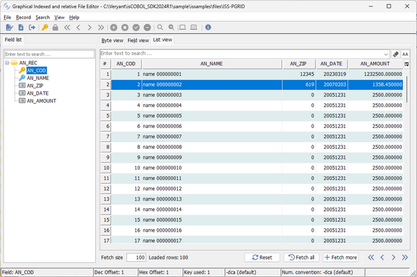
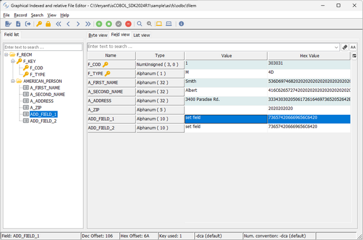
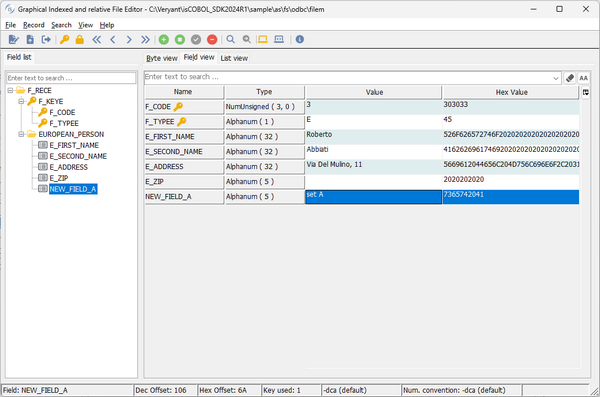
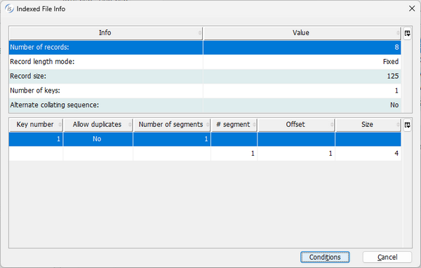
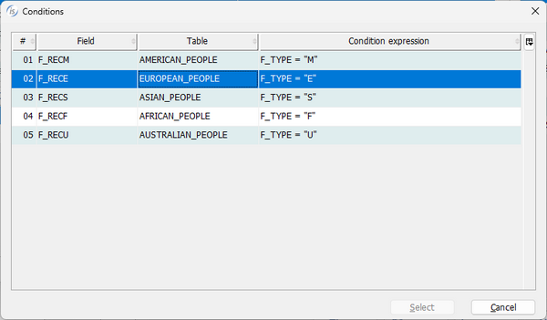

## GIFE enhancements

The GIFE (Graphical Indexed and relative File Editor) utility, has been improved in the 2024R1 release to add a new view that lets you see multiple records in a grid where every line is a record and every column is a field of the file. It also now supports files with 01 level redefines or conditional 01 levels in the FD declarations.

### New List view

When an indexed or relative file along with the EFD file created by the compiler option –efd is opened by GIFE, a new view named List view is available to see multiple records in a grid. This view is read-only, so to change the content or insert a new record the previous Field view should be used.

As shown in Figure 5, New List view, the records are loaded in grid rows. Using the buttons on the bottom pane, additional records can be loaded and viewed.

**Figure 5.** New List view.



The search box can be used to filter the data and load only the records that meet the filter criteria.

### Condition support

Veryant products such as Database Bridge and UDBC driver fully support files with multiple or conditional 01 levels in the field declaration. This information is stored in an .xml file generated using the -efd compiler option, and now GIFE can use this information to better display the records of such files in the Field view.

The following FD definition contains multiple 01 level definition, based on conditions:

```cobol
       fd  filem.
      $EFD WHEN F_TYPE = "M" TABLENAME = AMERICAN_PEOPLE
       01  f-recM.
           03 f-key.
              05 f-cod         pic 9(3).
              05 f-type        pic x.
           03 american-person.
              05 a-first-name  pic x(32).
              05 a-second-name pic x(32).
              05 a-address     pic x(32).
              05 a-zip         pic x(5).
              05 add-field-1   pic x(10).                        
              05 add-field-2   pic x(10).                        
      $EFD WHEN F_TYPE = "E" TABLENAME = EUROPEAN_PEOPLE
       01  f-recE.
           03 f-keyE.
              05 f-codE        pic 9(3).
              05 f-typeE       pic x.
           03 european-person.
              05 E-first-name  pic x(32).
              05 E-second-name pic x(32).
              05 E-address     pic x(32).
              05 E-zip         pic x(5).                        
              05 new-field-A   pic x(5).                        
              05 filler        pic x(15).                        
       ...
```

and is now fully supported by GIFE.

As shown in Figure 7, Condition for American record, and Figure 8, Condition for European record, the fields loaded in the Field view are the ones listed in the specific 01 level.

When reading different records, depending on which condition is satisfied, the relevant fields are displayed in the Field view.

**Figure 7.** Condition for American record.



**Figure 8.** Condition for European record.



It’s also possible to list all the conditions present in the file by opening the File Info and then pressing the button named “Conditions”. This opens an additional window as shown in Figure 9, File Info, and Figure 10, Conditions.

The same window with the list of conditions is also opened when inserting a new record that allows you to pick which 01 level to use when setting the fields contents.

**Figure 9.** File Info.



**Figure 10.** Conditions.


