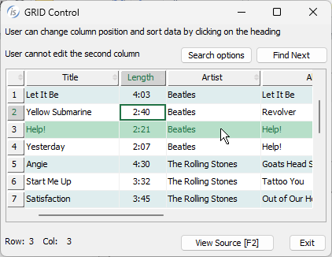

## GUI enhancements

IsCOBOL Evolve 2024 R1 GUI grid capabilities have been enhanced by implementing new properties to customize colors. A new property input-filter is now supported to better filter the input.

### Grid colors

The grid control has been improved and now you can set the rollover row color. Setting the row-rollover-color or alternatively row-rollover-foreground-color and row-rollover-background-color properties in the grid control will make the entire row be painted with the specified colors when the mouse is over a cell.

When the mouse hovers in a header cell, the single cell is painted with the color properties specified in the new heading-rollover-color or heading-rollover-background-color and heading-rollover-foreground-color.

The new cursor-frame-color can be used to apply a specific color to the borders of a cell that has focus.

For example, this is the code where the colors of the grid are set:

```cobol
           03 Gd grid boxed vscroll
              column-headings row-headings centered-headings tiled-headings
              adjustable-columns reordering-columns sortable-columns              
              row-background-color-pattern       (-16777215, -14675438)
              end-color                          -16774581
              heading-color                      257
              border-color                       rgb x#ACACAC
              heading-cursor-background-color    rgb x#D2D2D2
              heading-cursor-foreground-color    rgb x#217346
              cursor-frame-color                 rgb x#217346
              row-rollover-background-color      rgb x#B7DFC9
              row-rollover-foreground-color      rgb x#217346
              heading-rollover-background-color  rgb x#9FD5B7
              heading-rollover-foreground-color  rgb x#000000
              ...
```

The result of the program running is shown in Figure 4, Grid colors. The row covered by the mouse pointer is now more noticeable, and the cursor frame color has been harmonized to better blend with the colors used in the headings, providing clearer indications of the cursor's position.

**Figure 4.** Grid colors.



### Input-Filter property

A new property named input-filter is now supported in controls that accept data input, such as the Entry-Field, Combo-Box and Grid, giving the developer the ability to better filter the text users can type. A regular expression is used in this property, making it extremely flexible.

A code snippet like this:

```cobol
           03 ef1 entry-field 
              line 3 col 2 size 67 cells
              input-filter "[A-Za-z]+"
              ...
           03 cb1 combo-box drop-down unsorted
              line 6 col 2 size 67 cells
              input-filter "[A-Z\sa-z]+"
              ...
           03 Gd grid
              line 10 col 2 lines 9 size 67 cells
              display-columns (1, 5, 25, 35, 55, 80, 100, 120)
              data-columns    (1, 4, 34, 39, 59, 89, 104, 134)
              input-filter    ("*", "*", "[0-9:]+", "*", 
                               "*", "*", "*", "[0-9]+")
              ...
```

defines different rules of acceptable input data in the controls:

- the entry-field accepts letters without spaces
- the combo-box accepts letters and spaces
- the grid accepts numbers and “:” in the third column and only numbers in the last column. The rest of the columns have no restrictions.
