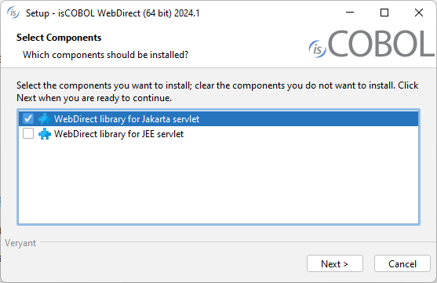
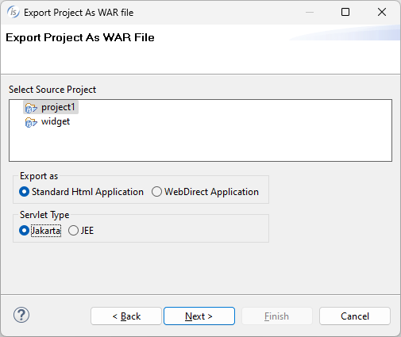

## Jakarta support

Jakarta EE, formerly Java Platform, Enterprise Edition (Java EE) and Java 2 Platform, Enterprise Edition (J2EE), is a set of specifications extending Java SE with specifications for enterprise features such as distributed computing and web services. Jakarta EE applications are run on reference runtimes, which can be microservices or application servers. These handle transactions, security, scalability, concurrency and management of the components they are deploying.

JEE refers to Java servlet version 4, while Jakarta refers to Java servlet version starting from 5, and the class package name changes from javax to jakarta.

To run the newer servlet version 5, you need a newer Java container. This means Tomcat up to version 9 supports servlet version 4 while Tomcat 10 supports servlet version 5. Also, GlassFish 5 supports up to servlet version 4 while GlassFish 6 extends servlet support to version 5.

Veryant products now support servlet version 5 to allow deploying applications to the latest versions of Java Containers such as Tomcat and GlassFish.

isCOBOL 2024 R1 supports Jakarta in all our products that run in a web environment, such isCOBOL WebClient, isCOBOL EIS Servlets, WebServices and WebDirect.

### IsCOBOL WebClient

WebClient supports the Jakarta specification when it is run as a web application inside a Java Container, and will automatically activate the needed components in the weclient-server.war and webclient-admin-server.war files accordingly.

When WebClient is executed with the provided wrappers, it will use the embedded Jetty server.

### IsCOBOL EIS

The new Jakarta servlet specification is supported in isCOBOL EIS Servlets and WebServices when using the standard “web.xml” file available with the installation.

If you need to deploy on an older version of a Java Container, a file called “web.jee.servlet.xml” is provided that contains the entries needed, and is the same as in previous releases.

The main difference between the two files are the lines that refer the class name. The following lines are needed to enable JEE support:

```cobol
 ...
          <filter>
                <filter-name>isCOBOL filter</filter-name>
                <filter-class>com.iscobol.web.IscobolFilter</filter-class>
          </filter>
   ...
          <servlet> 
                <servlet-name>isCobol</servlet-name>
                <servlet-class>com.iscobol.web.IscobolServletCall</servlet-class>
          </servlet>
   ...
          <listener>
           <listener-class>com.iscobol.web.IscobolSessionListener</listener-class>
          </listener>
   ...
```

The following lines are needed to support the new Jakarta specification:

```cobol
 ...
          <filter>
                <filter-name>isCOBOL filter</filter-name>
                <filter-class>com.iscobol.webjakarta.IscobolFilter</filter-class>
          </filter>
   ...
          <servlet> 
                <servlet-name>isCobol</servlet-name>
                <servlet-class>com.iscobol.webjakarta.IscobolServletCall</servlet-class>
          </servlet>
   ...
          <listener>
           <listener-class>com.iscobol.webjakarta.IscobolSessionListener</listener-class>
          </listener>
   ...
```

No other changes are needed in other deployed libraries, since iscobol.jar contains all the necessary classes.

### IsCOBOL WebDirect

To support both JEE and Jakarta containers, two sets of libraries are provided for isCOBOL EIS WebDirect deployment that are needed by the underlying ZK libraries on which WebDirect is built. isCOBOL 2024 R1 provides a separate WebDirect installer that allows you to choose the set of libraries to install based on the container specification. The installer will deploy the selected libraries in the isCOBOL SDK main folder.

If both JEE and Jakarta libraries are chosen, the installer creates two additional subfolders in the isCOBOL SDK Webdirect folder. The “webdirect/lib” and “webdirect/xml” folders contain the necessary files for a Jakarta container, while the JEE related files will be stored in the “webdirect/lib/jee” and “webdirect/xml/jee”.

As shown in Figure 1, isCOBOL WebDirect installer, the developer can select the appropriate Jakarta or JEE servlet libraries depending on the container used for deploying.

**Figure 1.** isCOBOL WebDirect installer.



### IsCOBOL IDE

isCOBOL 2024 R1 IDE supports Jakarta, and the feature “Export Project as WAR file” that creates a .war file to be deployed in a Java container now asks the user to select the Servlet Type and will generate the correct libraries and configuration for the selected scenario.

This feature is available for isCOBOL projects that use WebDirect and for projects that use the isCOBOL HTTPHandler class, for example applications that leverage the WebServices bridge generation. As shown in Figure 2, Export to WAR file, the developer can select Jakarta or JEE in the Servlet Type area depending on the container used when deploying the application.

**Figure 2.** Export to WAR file.


