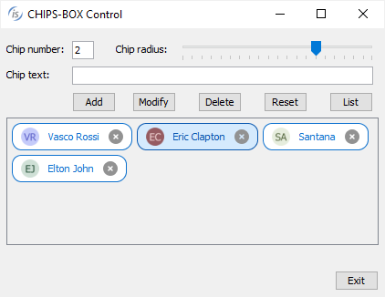
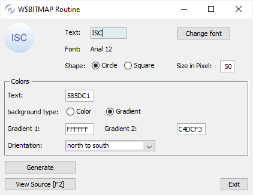
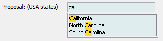
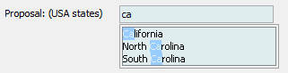
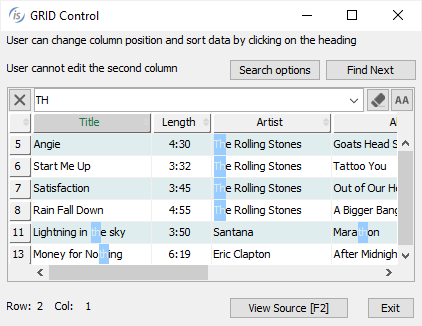

## Graphical interface

isCOBOL 2024 R2 introduces a new control named CHIPS-BOX, a container that shows a list of chips in a box. Additional enhancements involve W$BITMAP and configurations to let developers customize and centralize window creation and control events.

### CHIPS-BOX

The chips-box is typically used in web environments to let users pick a set of values from a predefined list, or to add new values not in the list. One of the most common uses of chips boxes is “tagging”, where the user can pick existing tags or make up new ones.

In the 2024 R2 release isCOBOL implements this new control, using the syntax shown below:

```cobol
       SCREEN SECTION.
       ...
          03 chips chips-box chips-type 2 chips-radius radius-factor
             line 8 col 2 size 68 lines 10
             event CHIP-EVT.
       ...
       PROCEDURE DIVISION.
       ...
           modify chips item-to-add chip-item-text 
                        bitmap image-handle(idx)
                        bitmap-number 1 bitmap-width 78-bmp-width
                        item-foreground-color 78-chip-color-1
                        item-background-color 78-chip-color-2
                        item-border-color -946895
                        item-rollover-background-color -14019325
                        item-rollover-foreground-color -678063
                        item-rollover-border-color -678063
                        hidden-data hidden-chip
                        giving item-id
```

The snippet declares a chip box element in the screen section, and in the procedure division the MODIFY statement adds a new chip with a leading bitmap.

The container can be customized using the following properties:

- CHIPS-TYPE can be set to 1 for chips that include just text and an optional leading bitmap, or 2 for chips that include text, an optional leading bitmap and a trailing x icon that the user can click to remove the chip.
- CHIPS-RADIUS to set the percentage of the rounded borders, from 0 to have sharp borders to 100 to have circular borders.
- CHIPS-BORDER-WIDTH to set the width of the chips’ borders.
- CHIPS-ROLLOVER-BORDER-WIDTH to set the width of the chips’ borders when the mouse is over the chip.

Colors can be set on the chips themselves, or can be set as default on the container using the specific properties:

- ITEM-COLOR, ITEM-FOREGROUND-COLOR and ITEM-BACKGROUND-COLOR to set the color of the chip.
- ITEM-BORDER-COLOR to set the border color of the chip.
- ITEM-ROLLOVER-COLOR, ITEM-ROLLOVER-BACKGROUND-COLOR and ITEMROLLOVER-FOREGROUND-COLOR to set the color of the chip when the mouse is over the chip.
- ITEM-ROLLOVER-BORDER-COLOR to set the border color of the chip when the mouse is over the chip.

The result of running the program is shown in Figure 4, *New CHIPS-BOX control*, and the user is selecting the second chip, which is then painted using the rollover colors set.

**Figure 4.** New CHIPS-BOX control.

When the user clicks on the chip, the CMD-CLICKED event is fired, and when the X icon is clicked, the MSG-CLOSE event is fired. Developers can implement code to react to such events.

### W$BITMAP

The new WBITMAP-TEXT-BOX opcode has been implemented in the W$BITMAP routine to generate images from text. The typical usage scenario is to display an avatar for a user account: if a user does not have an image selected for the account, an image is shown with the user’s initials.

This feature is also used in the previous program for CHIPS where the leading bitmap is created dynamically by the program.

This code snippet:

```cobol
           initialize wbitmap-tb-data
           set wbitmap-tb-circle to true
           move h-font to wbitmap-tb-font
           move p-size to wbitmap-tb-width
           move wrk-text-color to wbitmap-tb-text-color
           move wrk-back-color to wbitmap-tb-bg-color
           move wrk-grad-color to wbitmap-tb-bg-color-2
           move gradient-north-to-south to wbitmap-tb-grd-or
           move "ISC" to p-text
           call "w$bitmap" using wbitmap-text-box
                                 p-text 
                                 wbitmap-tb-data
                          giving h-image-icon
```

can be used to create an image with the text and color settings passed in the structure wbitmap-tb-data, and the resulting bitmap handle h-image-icon can be used in any control that supports a bitmap handle.

The results of the program in execution are shown in Figure 5, *W$BITMAP wbitmap-textbox op-code*, where the text “ISC” is represented in the circle image.

**Figure 5.** W$BITMAP wbitmap-text-box opcode.

### Other GUI enhancements

The entry-field proposal feature has been enhanced by adding a new PROPOSAL-FILTERTYPE property that can be used to customize filtering of the proposal list of Entry-Field, and the possible values can be:

- 0: no filtering is performed, and the list is always shown entirely
- 1: filters with a case insensitive "contains" logic
- 2: filters with a case insensitive "starts with" logic

In addition, the text that matches is highlighted in the list. The following is a code snippet that shows usage the new property:

```cobol
       03 ef-state entry-field value w-state
          line 5, col 20, size 20 cells
          proposal-filter-type 1.
```

In Figure 6, *PROPOSAL-FILTER-TYPE on entry-field*, shows the results when running with filtering in progress.

**Figure 6.** PROPOSAL-FILTER-TYPE on entry-field.

The window supports a new WINDOW-STATE property that can be used in the INQUIRE statement to detect the state of the window, allowing the code to check if the window is minimized or maximized, as shown in this snippet of code:

```cobol
           inquire h-win window-state wstate
           evaluate wstate
           when win-normal ...
           when win-iconified ...
           when win-maximized-both ...
           end-evaluate
```

The event-data-1 and event-data-2 data items returned in the MSG-MOUSE-ENTER event fired for controls like grids, list-box and tree-view when the NOTIFY-MOUSE style is set now contain more detailed information. For example, in a grid the cell coordinates are included, and in a tree-view the mouse coordinates are included.

New configurations have been implemented to customize GUI control behavior:

- *iscobol.gui.window.hook* assigns a class to customize the DISPLAY WINDOW behavior.

The class needs to implement the isCOBOL interface ”com.iscobol.rts.WindowCreateHandler”. Developers can inquire and modify attributes before or after window creation.

The following is a code snipped of the class-id source:

```cobol
       IDENTIFICATION DIVISION.
       CLASS-ID. WCWINHANDLER AS "WCWINHANDLER" IMPLEMENTS WINCREATEHANDLER.
       ...
       CLASS WINATTRIBUTEHOOK AS "com.iscobol.gui.server.WindowAttributeHook"
       CLASS WINCREATEOVEXC AS "com.iscobol.rts.WindowCreateOverflowException"
       CLASS WINCREATEHANDLER AS "com.iscobol.rts.WindowCreateHandler"
       ...
       METHOD-ID. IS-WINDOWCREATE AS "beforeWindowCreate" override.
       ...
       LINKAGE SECTION.
       77 MyWinAttribute OBJECT REFERENCE WINATTRIBUTEHOOK.
       procedure division using MyWinAttribute raising WINCREATEHANDLER.
       if env-code = runenv-web-client
       set win-type to MyWinAttribute:>getType
       if win-type = "INDEPENDENT"
       MyWinAttribute:>setBackground(-16054009)
       MyWinAttribute:>setUndecorate(true)
       end-if
       end-if
       ...
       METHOD-ID. IS-AFTERWINDOWCREATE AS "afterWindowCreate" override.
       ...
       LINKAGE SECTION.
       77 myWinhandler OBJECT REFERENCE WINCREATEHANDLER.
       procedure division using myWinhandler raising WINCREATEHANDLER.
       ...
```

When running using the configuration:

```cobol
iscobol.gui.window.hook=WCWINHANDLER
```

the class is invoked for every window created. If the window type is INDEPENDENT and the runtime environment is WebClient then the window is colored differently and set to UNDECORATE. This feature allows extensive control to windows. For example, a hook program can be used to customize the appearance of an application depending on the environment the program is run on.

- *iscobol.gui.matching_text_color* specifies a matching color in entry-field, list-box and grid controls. When running using the configuration:

```cobol
iscobol.gui.matching_text_color=-10079487,-14675438
```

the selected text in the entry-field proposal and in the search result of list-box and grid controls is painted using the provided combination of RGB colors as background/foreground text color.





• *iscobol.hot_event.\<\program-name\>\=\<\event-type(s)>* provides a custom handler for specific GUI events. The program-name is a program-id that receives an event-status structure as parameter in linkage section.

For example, a program like this:

```cobol
       program-id. EFXICON.
       working-storage section.
       copy "iscontrols.def".
       77 w-class pic 99.
       linkage section.
       copy "iscrt.def".
       procedure division using event-status.
       MAIN.
           inquire event-control-handle class in w-class
           if w-class = ctl-entry-field
              if event-data-1 = 2 | click on the trailing bitmap (Xmark)
                 modify event-control-handle value ""
              end-if
           end-if
           goback 0.
```

with the configuration set using:

```cobol
iscobol.hot_event.EFXICON=16400
```

will enable a developer to centrally manage the events msg-bitmap-clicked for the entire application.

The program EFXICON will be executed and it will manage the event with specific code just for clicking on trailing bitmaps in entry-field controls.

This solution can be easily adopted when using code injection. For example to activate the X icon as a trailing bitmap in all entry-fields, just compile with this configuration:

```cobol
iscobol.compiler.gui.entry_field.defaults=bitmap-handle h-tools \
                             bitmap-trailing-number 78-nb-xmark \
                             bitmap-width 78-tb-bmp-width \
                             event evt-ef-empty
```

This approach of centralized handling is similar to what can be achieved using the configuration *iscobol.hot_key.PROGNAME=n* to manage the function keys or any exception value.
