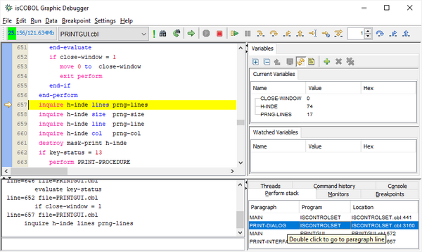
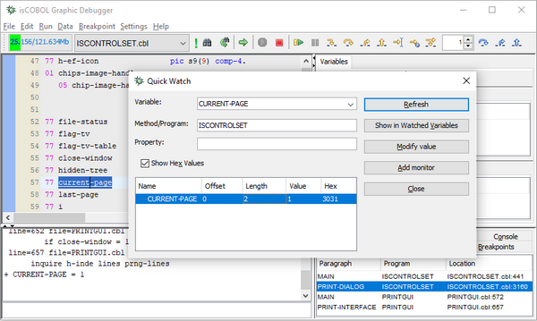
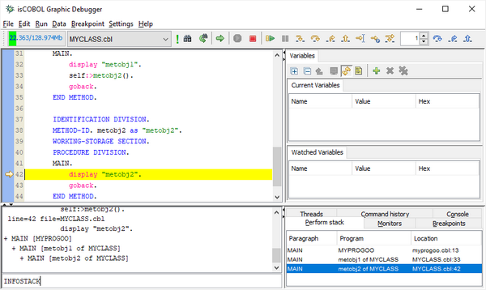

## isCOBOL Debugger

isCOBOL Debugger 2024 R2 supports full access to data items of programs and classes in the stack, granting complete control for developers. 2024R2 also introduces other enhancements to Perform stack view and Breakpoints.

### Access to data items in the stack

During the execution of application using the debugger it’s typical to access data items of the current program to show or change the values. However sometimes it’s also necessary and useful for developers to access the values of data items defined in previous programs.

For example, it can be useful to inspect variables in a caller program to check how parameters passed to the called program were assigned. Starting from 2024R2, isCOBOL Debugger supports access to data items contained in programs and classes in the stack.

By double clicking on the needed line in the Perform stack view, as shown in Figure 1, *Open a program from the Stack*, the corresponding source code is loaded, and all the commands related to the data items are supported. When opening the dialogs related to data items, the new field Method/Program is already set to the appropriate source file name, as shown in Figure 2, *Quick Watch with Program set*.

**Figure 1.** Open a program from the Stack

**Figure 2.** Quick Watch with Program set

In addition to the “Quick Watch” dialog all other dialogs that contain the “Variable name” field, such as “Display variable”, “Modify variable”, “Display offset of variable”, “Display length of variable” and “Set monitor” have this new “Method/Program” field enabling developers to use this feature without the need to reload the previous source. This is useful when developers can specify names of the data items in previous programs directly.

The commands used in the Debugger command-line now have the option -c to specify the class name where the data item is declared, for example:

```cobol
dis -c ISCONTROLSET current-page
let -c ISCONTROLSET current-page = 1
```

or, in case of CLASS-ID sources:

```cobol
dis -c MyClass:>MyMethod myvar
let -c MyClass:>MyMethod myvar = abc
```

These commands will display and modify the values of the current-page variable in ISCONTROLSET program and the myvar variable in the MyMethod of MyClass.

### Perform stack and Breakpoints

The Perform stack view and the output produced by the “infostack” command has been enhanced when using methods and entry-points. To better identify the current method or entry-point name in the Perform stack view, the syntax “of” has been added in the “Program” column. This is similar to the name of paragraphs shown in the Paragraph column when there are section names as well. For example:

- “LOAD of SECT1” in the Paragraph means “LOAD” paragraph in “SECT1” Section
- “LOADLIB of MYLIB” in the Program means “LOADLIB” entry-point in “MYLIB” Program-id
- “setDate of MyClass” in the Program means “setDate” method in “MyClass” Class-id

As shown in Figure 3, *Enhancements to Breakpoints*, the output of the “infostack” command has also been improved with the same “of” syntax.

**Figure 3.** Enhancements to Breakpoints

In addition, breakpoints set on “program”, “method” and “paragraph” level are maintained between different Debugger sessions also in case that the number of lines in the source is changed.
