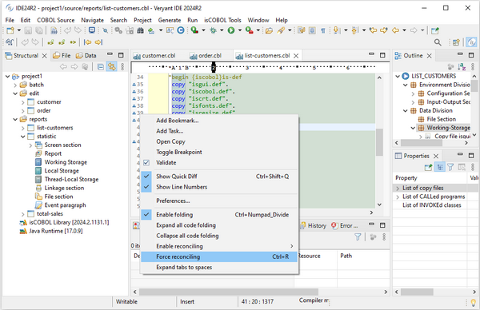

## isCOBOL IDE

isCOBOL IDE 2024 R2 supports subfolders in the “Structural view” used for Screen programs or WOW programs and in the “Data view” used for FD/SL files managed in the painters. This enables developers to more effectively organize a project, keeping the programs of different categories in different folders.

In addition, the Reconciling feature can now be executed on demand with a menu item or by using the corresponding hot key combination when the developer needs it. This is useful when the Reconciling feature is not always activated, allowing it to be executed as needed.

In Figure 7, *IDE subfolders and Force reconciling*, the new features are shown.

**Figure 7.** IDE subfolders and Force reconciling.
