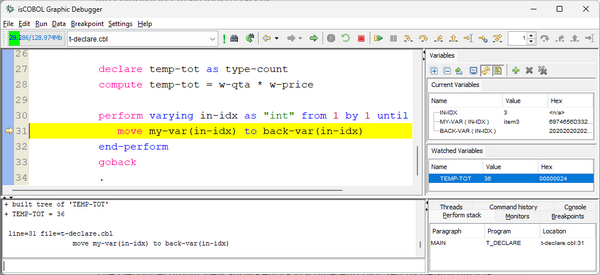
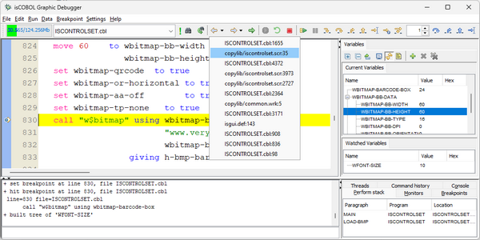
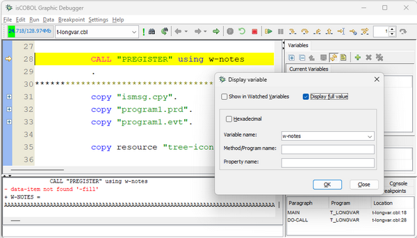

## Debugger enhancements

The isCOBOL Debugger has been improved, adding support for inline and local variables, improved code navigation and other minor improvements.

### Inline and local variables

Inline declared items and local variables using the DECLARE statement are now fully supported in the debugger. When compiling a source that contains DECLARE statements or inline items in debug mode, the compiler generates additional .class files that start with the same program name and have a suffix like $LocalVars$n.

The debugger uses these classes to access local variables. Source code needs to be compiled using the -d or -dx options (debug compilation).

As shown in *Figure 7, Access to local variables from Debugger*, the local variables are handled as regular variables, and they are integrated in Current Variables, in the Watched variables, etc... helping developers in the debugging activity.

**Figure 7.** Access to local variables from Debugger

### Other improvements

Two new buttons have been added in the Debugger tool-bar, and are used to execute the Back and Forward commands in the history of selected lines with the feature “Go to declaration”. Navigating to declaration can also be performed by double clicking on a paragraph name or a data item or using the hyperlink declaration. This feature simplifies source code navigation, allowing you to re-select a previously selected line, similar to how the isCOBOL IDE implements it in the Eclipse environment. As shown in *Figure 8, Back history feature*, the history of the navigated lines is listed in a pop-up menu, and selecting an item from the list will load the corresponding source file at the specified line.

**Figure 8.** Back history feature

The new RESTART command can be used to stop and automatically restart the debugging session. The command is also available in the Run menu and in a new tool-bar button.

By default, the Output view shows the first 1024 characters of a data item, but the existing Display and Env commands have been improved with the addition of the -full option, which will display the whole content of large data items.

In addition, the graphical window “Display variable” now contains a new check-box to specify the –full option.

The Debugger Output view now shows errors using a different color, red by default but it can be customized in the “Fonts and Colors” settings.

As shown in *Figure 9, -full option*, the new option is used to show the content of the large data item and the previous command executed with a typo error, -fill instead of –full, is shown in the Output view in red text.

**Figure 9.** –full option

