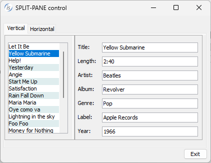
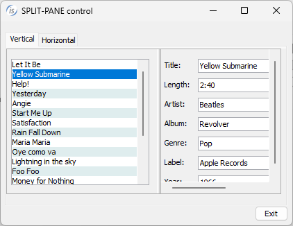
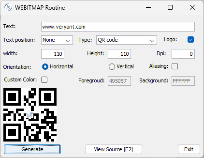
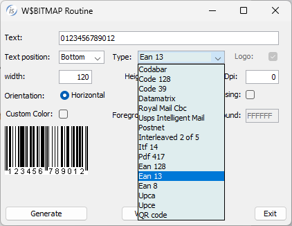
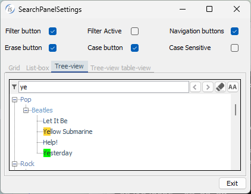
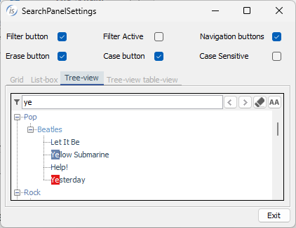

## GUI enhancements

IsCOBOL Evolve 2025 R1 introduces a new control, SPLIT-PANE, useful to enhance the visuals of GUI applications. Also, the W$BITMAP routine can now create barcodes of various types and the search panel has been updated.

### SPLIT-PANE

The new SPLIT-PANE is a control that can be used to divide a screen area into two sections, either horizontally or vertically, and allows the user to resize the panes by dragging a divider. This component is useful when the User Interface requires 2 sections, for example a master-details view, and to allow the user to control how much space each section should take up.

The container can be customized using the following properties:

- DIVIDER-LOCATION to specify the location of the divider bar in percentage of the size of the Split-Pane; default: 50.
- DIVIDER-SIZE to set the size in pixels of the divider bar; default: LAF dependent.
- MIN-DIVIDER-LOCATION to set the minimum location where the user can move the divider bar; default: 0.
- MAX-DIVIDER-LOCATION to set the maximum location where the user can move the divider bar; default: 100.
- SPLIT-ORIENTATION to specify if the split is horizontal (0, default) or vertical (1).

Additional properties that should be set on the controls include:

- SPLIT-GROUP to specify the name of the split pane to which a screen section group should be added.
- SPLIT-GROUP-AREA to specify the area of the split pane that will host the group of controls: 1 is left or top, 2 is right or bottom.

With the following code snippet:

```cobol
       SCREEN SECTION.
       01 Mask.
       ...
           05 split-pane-v split-pane
              line 2 column 2 size 78-split-pane-size cells lines 15.5
              divider-location     78-initial-percent-divider
              min-divider-location 20
              max-divider-location 70
              split-orientation    0
              border-color rgb     x#ACACAC
              event procedure      SP-EVENT.
              ...
           05 split-pane-v-page-1 
              split-group split-pane-v split-group-area 1.
              07 ls list-box
                 ...
           05 split-pane-v-page-2 
              split-group split-pane-v split-group-area 2.
              07 label title "Title:"
                 ...
       PROCEDURE DIVISION.
       ...
           display Mask
 
       SP-EVENT.
           if event-type = ntf-sp-resized
              evaluate true
              when event-data-1 > 78-initial-percent-divider
                   compute list-size = 78-initial-list-size +
                           ((78-sroll-pane-size / 100) * 
                            (event-data-1 - 78-initial-percent-divider))
              when ... 
              end-evaluate
              display split-pane-v-page-1
           end-if.
```

a split-pane is created with the two areas divided horizontally. The left pane contains a list-box, and the right pane contains entry fields. This is the typical example of a master-details scenario, where the list contains data, and when the user clicks an item the program loads the details of the selected item and displays them in the entry-fields on the right. The user can choose the size ratio between the master-view (the list-box) and the details-view (the entry-fields).

A new event procedure, NTF-SP-RESIZED, returns the selected percentage in the event-data-1 data-item.

When dragging the bar, the dimensions of the two areas are changed. The result of the program in execution with the original size is shown in *Figure 1, The Split-Pane with original size, while in Figure 2, The Split-Pane after resizing*, the same screen is shown with a different split ratio for the list-box. The source code is included in the issamples folder installed with the new release.

**Figure 1.** The Split-Pane with original size



**Figure 2.** The Split-Pane after resizing



### Barcode creation using W$BITMAP

Barcodes are very common and often need to be integrated in applications. The 2025 R1 release introduces the new WBITMAP-BARCODE-BOX in the W$BITMAP library to allow easy generation of bar codes from COBOL applications. Several barcode and output generation formats are supported.

The following is a code snippet from a sample included in the issamples folder of the new release and shows the use of the new feature:

```cobol
         call "w$bitmap" using wbitmap-barcode-box 
                               p-text
                               wbitmap-bb-data 
                               wrk-error-description
                        giving h-bmp-barcode.
```

The generated barcode image is stored in memory to be displayed using a control that has a bitmap property or printed with the WINPRINT-PRINT-BITMAP opcode in WIN$PRINTER routine. The image can also be stored in disk file by calling the W$SAVE_IMAGE routine and can then be printed using the P$DRAWBITMAP routine or used by third party applications that require the image on disk.

*Figure 3, A QR code generation*, shows the QR code generated by passing the string www.veryant.com in the text parameter of the W$BITMAP routine.

**Figure 3.** A QR code generation



*Figure 4, EAN 13 code generation*, shows the result of the image that is generated passing a numeric value with the EAN 13 barcode type.

**Figure 4.** EAN 13 code generation



### Customize the search panel

The search panel is an integrated component that appears by default when pressing Ctrl+F when the focus is on a control that contains multiple lines, such as grid, list-box or tree-view. The search panel can be made always visible by setting the SEARCH-PANEL to 1 on the control. On previous releases, this feature allowed users to filter the content of the control for a specific text, removing from view the lines not included in the filter. Starting from the 2025 R1 release it’s possible to specify if the search text should act as a filter or just to highlight the search text in lines. It’s also possible to navigate between the results with two new navigation buttons. This is like the search feature used by browsers when searching text on the page.

The new configuration option *iscobol.gui.search_panel_settings=nnnn* is used to set the visibility of items in the search panel. The value is a string of positional 0s and 1s that configuring, in order:

- Set the Filter operation mode to the filter or search behavior
- Enable Navigation buttons to change the selected search text
- Enable a Clean button to set the value of search entry to empty
- Case sensitive button to change the search criteria from sensitive to insensitive

In addition, the value 2 or 3 is supported for buttons to set the initial pressed state. The first and last buttons support these values. For example, 2 shows a visible and pushed button while 3 shows a visible but not pushed button.

The default value of this new configuration is 1012, which specifies the same filter behavior for backwards compatibility.

OOP syntax can be used to assign a different behavior to a specific control, invoking methods provided in the new com.iscobol.gui.server.SearchPanelSettings class

For example, the following code snippet:

```cobol
         REPOSITORY.
             class sp-settings as "com.iscobol.gui.server.SearchPanelSettings"
             class j-boolean   as "java.lang.Boolean"
             ...
         SCREEN SECTION.
         01  Mask.
             ...
             05 tv-songs tree-view
                ...
         WORKING-STORAGE SECTION.
         77  h-tv-songs            usage handle.
         77  tv-songs-settings     object reference sp-settings.
         PROCEDURE DIVISION.
         ...
             display Mask
             set h-tv-songs        to handle of tv-songs
             set tv-songs-settings to sp-settings:>new(h-tv-songs)
             tv-songs-settings:>setShowFilterButton(j-boolean:>TRUE)
             tv-songs-settings:>setFilterEnabled(j-boolean:>FALSE)
             tv-songs-settings:>setShowNavigationButtons(j-boolean:>TRUE)
             tv-songs-settings:>setShowCleanButton(j-boolean:>TRUE)
             tv-songs-settings:>setShowCaseSensitiveButton(j-boolean:>TRUE)
             tv-songs-settings:>setCaseSensitiveEnabled(j-boolean:>FALSE)
             ...
             accept Mask
             ...
```

Allows changing the visibility state of the search panel elements, using the handle for the control and calling the setters for the specific property.

*Figure 5, Customize the search panel*, shows the result of running a program with a fully customized search panel area, with the current search selection highlighted in green after pressing the navigation buttons. All the other matches are highlighted in yellow.

**Figure 5.** Customize the search panel



Other configurations have been implemented and improved:

- *iscobol.gui.search_delay=n* (default 500) to specify when the control should start filtering data while the user interacts with the search panel in grid, list-box and tree-view controls (also known as “debounce timer”)-
- *iscobol.gui.matching_text_color=n;n2* to set the two colors used to highlight the searched text: the first one, before ";", is used to specify the color for all the occurrences found (default yellow), and the color after the ";", is used to color the current occurrence selected with navigation buttons (default green). For example, setting *iscobol.gui.matching_text_color= -6849454,-16777215;-15014170,-16777215* will result in using light blue and red for background and white for both foreground colors when running the program. As shown in Figure 6, *Different matching colors*, the output of the same program in execution demonstrates how to easily change colors without changing code to achieve a coherent look and feel of the entire COBOL application.

**Figure 6.** Different matching colors



### Additional improvements

A New property, CELL-ALIGNMENT, has been implemented in the grid control to set the alignment of a specific cell. The values supported by CELL-ALIGNMENT are the same already supported in the property ALIGNMENT that is used to set on every cell in the entire column. Setting the new CELL-ALIGNMENT helps in aligning specific cells differently than the default alignment, for example to display right-aligned number cells. In the code snippet:

```cobol
         screen section.
         ...
            03 grid-days grid
               alignment ( "L" "R" )
               ...
         procedure division.
         ...
             modify grid-days (3, 2) cell-alignment "C"
```

the second column has alignment set to “R”, making it right aligned, but just the column at line 3 has set alignment set to “C” which is centered.

New styles have been added in the chips-box control:

- 3-D, BOXED, NO-BOX to set different types of boxing around the control
- UNSORTED to load the chips in the order specified by the program instead of having them automatically sorted in alphabetical order.

For example, with the following code snippet:

```cobol
         screen section.
         ...
            03 chips-favorite chips-box
               unsorted no-box
               ...
         procedure division.
         ...
             modify chips-favorite item-to-add "CC"
             modify chips-favorite item-to-add "BB"
             modify chips-favorite item-to-add "AA"
```

the container has the no-box style, which uses a flat look and feel, and the chips are displayed in the order in which they are inserted.

A new configuration, *iscobol.bitmap.load_method=2* allows loading legacy .BMP files that otherwise are not supported by the Java runtime. The configuration option activates a new graphics loading algorithm that can handle older formats.

The web-browser control VALUE property can now display HTML code directly instead of loading from a URL. When the value starts with "```<html>```" the content is assumed to be html code and not a URL.
