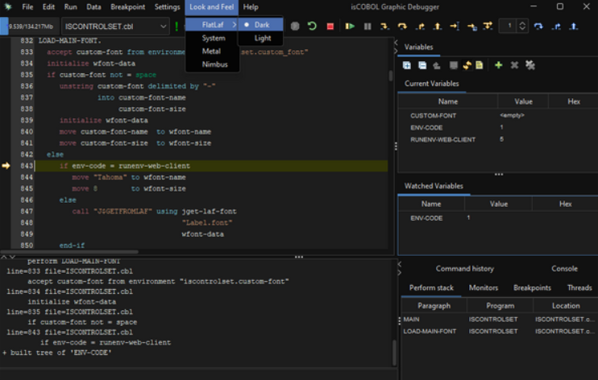
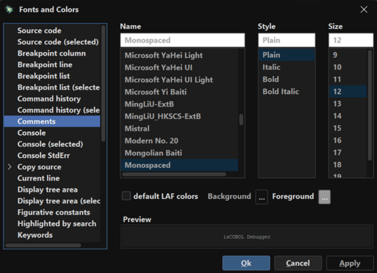

# Debugger enhancements

The isCOBOL Debugger has been improved, adding support for dark mode using FlatLAF and for changing the LAF on the fly.

## Dark mode support

Developers frequently choose dark mode for coding due to reduced eye strain, improved focus, and energy conservation. The darker background minimizes glare, especially on glossy screens, and can be more comfortable for prolonged coding sessions. Dark mode also offers a visually appealing aesthetic and can improve battery life on devices with OLED or AMOLED displays. Developers have been able to activate the dark mode in development environments such as Eclipse and Visual Studio Code. Starting from this release, dark mode can also be activated in the COBOL Debugger, another great tool where developers usually spend a lot of their time.

The LAF (Look-And-Feel) in the Debugger can be changed on demand with the new menu item “Look and Feel”, as shown in Figure 11, Debugger dark mode.

**Figure 11.** Debugger dark mode.

The “Fonts and Colors” settings now have two different sets of colors: one is the equivalent of the previous light theme, and one for the new dark theme. The color settings are saved in separate sections of the configuration for light and dark themes, allowing for full customization. Figure 12, Debugger color settings, a gray color is used for COBOL comments.

**Figure 12.** Debugger color settings.

