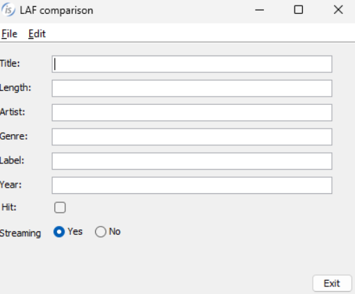
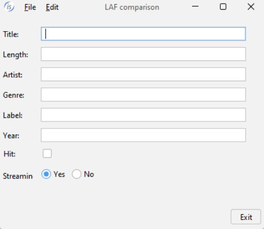
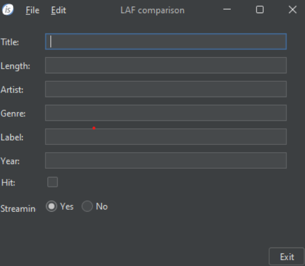
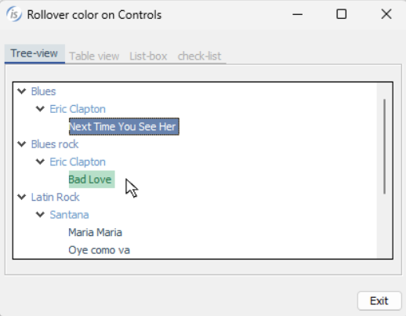
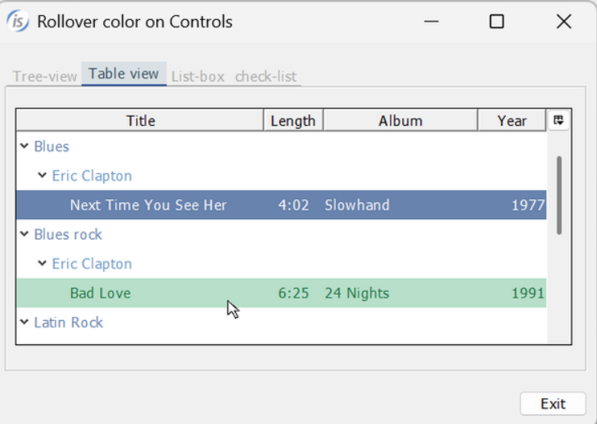
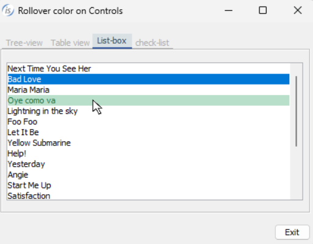
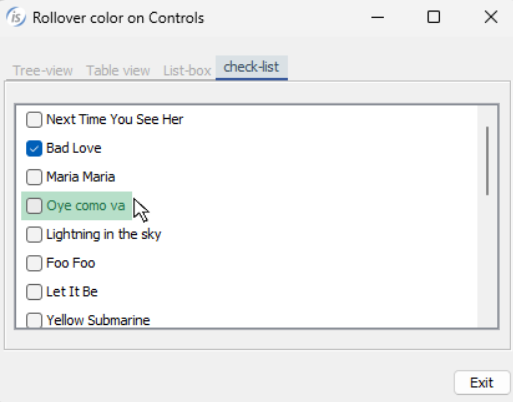
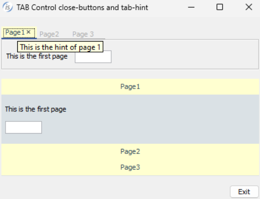
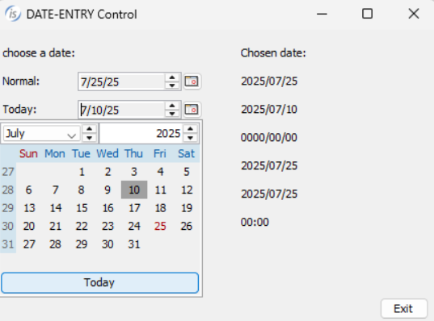

# GUI enhancements

IsCOBOL Evolve 2025 R2 integrates a new LAF (visual appearance and user interaction style of applications) named FlatLaf that supports different themes. Several improvements have been implemented in graphical controls: list-box and tree-view controls now support rollover properties, tab-control adds support for multiple hints and close buttons icons, now you can customize the load on demand feature of the grid control, and a new style has been added in the date-entry control.

## FlatLaf

The new command line option --flatlaf ```<theme>``` for the isrun and isclient commands has been implemented to easily integrate the execution of COBOL applications with the FlatLaf Look & Feel. FlatLaf is a modern open-source cross-platform Look and Feel for Java applications. It looks almost flat, clean, simple, and elegant. FlatLaf comes with Light, Dark, IntelliJ and Darcula themes, that can be activated from the command line, for example:

```cobol
isrun --flatlaf FlatLightLaf PROGNAME
iscrun --flatlaf FlatDarkLaf PROGNAME
isclient --flatlaf FlatIntelliJLaf PROGNAME
iscclient --flatlaf FlatDarculaLaf PROGNAME
```

To get the full benefits of this LAF, the application should be executed with the configuration

```cobol
iscobol.gui.native_style=1
```

For best results, especially for dark themes, the program should minimally manage the colors of the window, using the J$GETFROMLAF routine to retrieve the theme color, as demonstrated with this code snippet:

```cobol
        call "J$GETFROMLAF" using jget-laf-color, 
                               "Panel.background",
                               window-background-color
        call "J$GETFROMLAF" using jget-laf-color,
                               "Panel.foreground",
                               window-foreground-color  
        display standard window
        title "LAF comparison"
        background-color window-background-color
        foreground-color window-foreground-color
        ...
```

In figures 1 through 3 you can see the same program running with different LAF options to show varying results. In Figure 1, Windows look, the program is executed without any option, which defaults to --system being used. Figure 2, FlatLightLaf shows the program running using the --flatlaf FlatLightLaf option and in Figure 3, FlatDarkLaf the program is executed with the --flatlaf FlatDarkLaf option.

**Figure 1.** Windows look.



**Figure 2.**  FlatLightLaf look.



**Figure 3.** FlatDarkLaf look.



## Rollover effect

Rollover properties are already available in the grid control to set the rollover row color -- the color that is applied to an item when the mouse hovers over it. In this release the tree-view and list-box controls have been improved and now support the rollover item color. Setting the item-rollover-color property -- or alternatively, the item-rollover-foreground-color and item-rollover-background-color properties -- in the tree-view and list-box controls will result in the item being painted with the specified colors when the mouse hovers over them.

When the mouse hovers in a header cell in the tree-view table-view, the single cell is painted with the color properties specified in the new heading-rollover-color or heading-rollover-background-color and heading-rollover-foreground-color.

The following code shows how to apply the new color properties in the tree-view and list-box controls:

```cobol
              05 Tv1 tree-view
                 item-rollover-background-color rgb x#B7DFC9
                 item-rollover-foreground-color rgb x#217346
                 ...
              05 Tree-table tree-view table-view
                 item-rollover-background-color    rgb x#B7DFC9
                 item-rollover-foreground-color    rgb x#217346
                 heading-rollover-background-color rgb x#9FD5B7
                 heading-rollover-foreground-color rgb x#000000
                 ...
              05 Ls list-box
                 item-rollover-background-color rgb x#B7DFC9
                 item-rollover-foreground-color rgb x#217346
                 ...
              05 Ls-check list-box check-list
                 selection-mode lssm-multiple-interval-selection
                 item-rollover-background-color rgb x#B7DFC9
                 item-rollover-foreground-color rgb x#217346
                 ...
```

The running program is shown in Figure 4, Tree-view colors and Figure 5, List-box colors. On both controls, the item highlighted by the mouse pointer is now more noticeable.

**Figure 4.** Tree-view colors.





**Figure 5.** List-box colors.





## Tab-Control

The tab-control has been improved by adding the option to set a specific hint for every page. When setting the new property tab-hint in conjunction with the tab-index, the specified hint is shown when the mouse hovers over the tab title area of every style of tab-control: standard, allow-container and accordion.

In addition, a new style called close-buttons adds an “x” icon on the right of every page in the tab, allowing you to manage the closing action of the page. When the user clicks on this icon, the tab page is deleted. The MSG-CLOSE event is fired, and the application can perform actions and block the action if needed.

For example, the code snippet:

```cobol
           03 Tb1 tab-control
              line 2 col 2 lines 5 cells size 68 cells
              close-buttons
              ...
           03 Tb2 tab-control accordion
              line 8 col 2 lines 11 cells size 68 cells
              close-buttons
              event tb2-evt
              ...
           modify Tb1 tab-to-add ("Page1", "Page2", "Page 3")
           modify Tb1 tab-index 1 tab-hint "This is the hint of page 1"
           modify Tb1 tab-index 2 tab-hint "This is the hint of page 2"
           modify Tb1 tab-index 3 tab-hint "This is the hint of page 3"
           ...
       tb2-evt.
           if event-type = msg-close
              if event-data-1 = 2 and flag-edit = 1
                 set event-action to event-action-fail
              else
                 move 1 to flag-delete
           end-if.
```

creates two tab-controls that have the new close-buttons style, and specific page hints are applied to the first tab-control. The tb2-evt procedure is linked to the second tab-control and it performs a check to cancel the closing of a tab page if a specific condition is not met.
The result of the program running is shown in Figure 6, Tab-control enhancements.

**Figure 6.** Tab-control enhancements.



## Grid

The grid-control has a property, LOD-THRESHOLD, that can be used to dynamically load the contents as the user scrolls in the grid, allowing a large number of records to be efficiently shown in the grid. Starting from this release, the MSG-LOAD-ON-DEMAND event has been improved by setting the EVENT-DATA-1 data item to represent the user action that triggered the loading event. The application can use this information to process the event accordingly. Additionally, setting EVENT-ACTION data item to EVENT-ACTION-COMPLETE will prevent the cursor from moving automatically if the action was already performed by code.

For example, the following code snippet:

```cobol
           03 gd grid use-tab 
              lod-threshold 80
              event GD-EVT
              ...
 
       GD-EVT.
           evaluate event-type
           when msg-load-on-demand
                evaluate event-data-1
                when grlod-arrow-down-key
                when grlod-tab-key
                     perform LOAD-FEW-RECORDS
                when grlod-page-down-key
                when grlod-scroll-bar-drag
                     perform LOAD-SOME-RECORDS
                when grlod-ctrl-end-key
                     perform LOAD-ALL-RECORDS
                     modify gd cursor-y w-last-row
                     set event-action to event-action-complete
                end-evaluate
           ...
```

performs different actions based on the key that the user pressed. In this example, scrolling using the arrow keys or using the mouse will load a set number of records, while pressing Ctrl+End will load all the records.

## Date-entry

In the date-entry control, a new style named TODAY-BUTTON-VISIBLE has been implemented to show the “Today” button in the calendar opened to choose the date.

For example, the following code snippet:

```cobol
            03 date-entry today-button-visible
              line 12 col 14 size 20 cells
              ...
```

uses the new style, and running the program is shown in Figure 7, Date-entry Today button. When the “Today” button is pressed, the calendar closes, setting the value to the current date.

**Figure 7.** Date-entry Today button.


