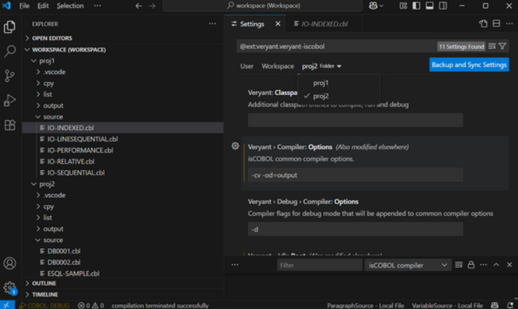
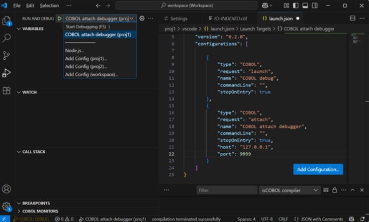

# Visual Studio Code extension enhancements

The Veryant extension for Visual Studio Code has been enhanced and now has workspace support, debug/release compilation mode, and the ability to debug remote processes.

## Workspace support

Visual Studio Code supports grouping folders and projects in “workspaces”. Starting from this release, Veryant Extension for Visual Studio Code supports workspaces, and each project folder can have its own settings for both compiler and runtime options.

Supporting workspaces allows developers to open multiple projects, compile and run each using project-specific SDK, JDK and JRE versions, compiler options such as compiler switches and compiler libraries, and run programs with specific runtime versions and options, such as configuration settings and runtime libraries. The “Compile Project(s)” command has been enhanced to compile all sources for every open project. When selecting sources belonging to different projects and invoking the “Compile selected files”, the command will apply the correct project compiler options.

When working with workspaces, settings can be saved at the project (folder) level, at workspace level, or at user level. Settings are stored in the relative folder and are applied with the correct priority: project setting, workspace settings, user settings.

## Debug/release compilation

A new compilation switch has been added to globally set the compile mode to either Debug or Release. When compiling sources, the compiler options are set by combining the content of the veryant.compiler.options variable with the compile-mode specific options. The mode-specific compiler options are stored in the settings "veryant.debug.compiler.option” and "veryant.release.compiler.options".

The active mode is displayed in the lower-left portion of the status bar and clicking it will invoke the switch selector in the “command section” of the editor, where a new mode can be selected.

Typical settings that are used when compiling in debug mode include the –d or –dx flags. Additional settings include the –od flag to specify different output folders for release-mode and debug-mode classes.

In Figure 14, *VS Code settings*, shows settings for compiler options flags set for a specific folder of a workspace.

**Figure 14.** VS Code settings.

## Remote debugging

The new release of the Visual Studio Code extension can now be used to attach a debugging session to a remote program by specifying the IP/hostname and port number in the launch configuration settings.

This can be useful to debug processes running on a remote server or when the code is run outside Visual Studio Code; for example when the COBOL program is started from a C or Java process.

Use the runtime option iscobol.rundebug=1 or 2 to instruct the VS Code extension to attach the debugging session to a running process.

In Figure 15, *VS Code attach debugger*, we see the new “attach” request type for the debugger that allows remote debugging of processes running outside Visual Studio Code.

**Figure 15.** Visual Studio Code attach debugger.

