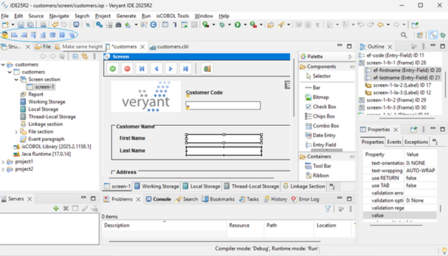

# IsCOBOL IDE enhancements

isCOBOL IDE, the Integrated Development Environment based on Eclipse, supports importing projects and settings. The new release adds support for new types of imports from a command line and improves usability in screen and report painters.

## Import from command line

isCOBOL’s IDE implements several command-line switches that allow you to perform tasks in the background without user interaction. This is useful to automate the creation of a workspace using components that are needed. The new release adds new import capabilities for:

- isCOBOL Data Layout files (.idl extension),
- isCOBOL Screen Program files (.isp extension),
- isCOBOL Wow Program files (.wsp extension),
- R/M Wow Program files (.wpj extension)

For example, to import all the .idl files saved in \myproject\idl and all the .isp files saved in \myproject\isp to an empty workspace, these 2 commands can be executed:

```cobol
isIDE -data \new-workspace -nosplash --launcher.suppressErrors –application com.iscobol.plugins.screenpainter.IscobolScreenPainter.importIdlApplication project newproject folder \myproject\idl
 
isIDE -data \New-workspace -nosplash --launcher.suppressErrors –application com.iscobol.plugins.screenpainter.IscobolScreenPainter.importIspApplication project newproject folder \myproject\isp
```

## Painters’ usability

A new toolbar with buttons for alignment and lock features has been added to the IDE for screen and report painters. These buttons improve the usability for developers that prefer working with a mouse, as shown in Figure 13, Painter’s new buttons.

**Figure 13.** Painter’s new buttons.



Additionally, a new setting "Generate copy books in the 'Screen Program Copy' folder" has been added in “WOW - Code Generator” to customize the folder where .prd and .wrk copy files are generated.
