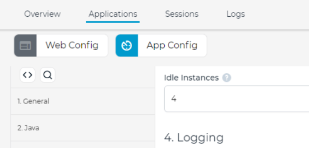
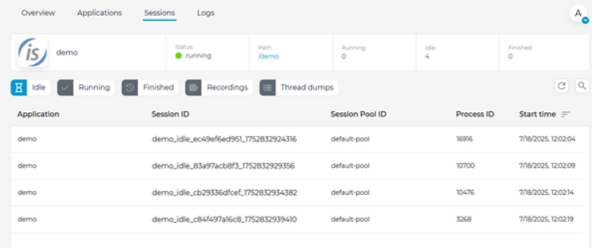
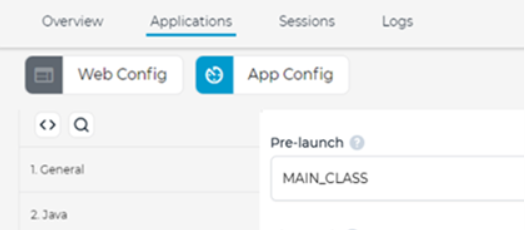

# IsCOBOL WebClient

IsCOBOL WebClient 2025 R2 features upgraded components, such as Jetty embedded server, and supports Java 21. This version also supports idle instances to reduce the startup time and includes an embedded Session Pool in the Cluster Server.

## Upgraded components

Jetty 12 is the integrated servlet container used to serve contents, and it supports the execution of WebClient with Java 21. This completes support of the latest Java LTS version for all Veryant products.

Jetty 12 requires at least Java 17 to run, and WebClient will now automatically fallback to using Tomcat as default servlet container when running with Java 1.8 or Java 11.

WebClient will handle the switch automatically and transparently.

## Idle instances

This feature lets you define a number of instances of a program that will be automatically started before any user actually makes a request. The purpose of idle instances is to reduce the startup time users must wait by eliminating the JVM startup delay. You can configure how many idle instances should always be available in the “App config” section of the Admin Console. In Figure 8, App configuration with 4 idle instances, shows a configuration that sets 4 idle instances for the selected application.

**Figure 8.** App configuration with 4 idle instances.



Using the above configuration, you will always find 4 additional Java processes in your system. These processes are created as soon as you save the modification to the configuration, and every time you restart the WebClient service.

Whenever a user requests the execution of the webapp, one of these idle Java processes will be used. Since it has already started, the user doesn’t have to wait for the JVM initialization and will experience a faster application startup time. After a sleeping Java process has been used, the WebClient service will immediately start a new one so that the configured number of idle instances is always guaranteed.

You can see the count and the list of currently running idle instances in the Sessions view in the Admin Console, as depicted in Figure 9, IDLE instances in the Sessions view.

**Figure 9.** IDLE instances in the Sessions view.



When you change your app configuration, idle instances are automatically recreated.

The Pre-launch configuration entry lets you choose if the application main class must be executed along with the idle JVM startup or only when the user requests a new session. The possible values are:

- NONE: The launch of idle instance stops right before calling the main class defined in the app launch configuration. The main class of your app will be called after the user requests a new instance. This is the default.
- MAIN_CLASS: This option launches the idle instance fully, including calling the main class defined in app launch configuration. When a user requests a new connection, the program will be instantly ready for use. This choice produces a faster startup but has some limitations: because the idle instance is launched before the user requests the program, user-defined variables in configuration parameters – such as userDir, vmArgs, etc. -- won’t be recognized.

The next picture, Figure 10, Pre-launch setting, shows the Pre-launch option set to MAIN_CLASS.

**Figure 10.** Pre-launch setting.



## Embedded Session Pool in Cluster Server

The Cluster Server can now be started with a Session Pool included in the same java process. The embedded Session Pool is exactly the same as a standalone Session Pool. To start a Cluster Server with embedded Session Pool, use the -clustersessionpool command line option.

When you start the Cluster Server as a foreground process, pass the option on the webcclient-cluster command line, for example:

```cobol
webcclient-cluster –clustersessionpool
```

When you start the Cluster Server as a Windows Service, pass the option on the sc command line, for example:

```cobol
sc create "WebClientClusterEmbeddedSp" start= auto binPath= "C:\Veryant\isCOBOL_WEBC2025R2\bin\webclient-cluster.exe -p 8080 –clustersessionpool
```

When you start the Cluster Server as a Unix daemon, pass these options through the WEBCLIENT_CL_OPTS environment variable, for example:

```cobol
export WEBCLIENT_CL_OPTS=-p 8080 -clustersessionpool
webclient-cluster start
```

The embedded Session Pool will look for configuration files in the root directory, but you can also provide the path to the files through these command line options:
- -pfsp /path/to/webclient-sessionpool.properties
- -csp /path/to/webclient-app.config

To start the embedded Session Pool when deploying to Tomcat you can define these additional system properties:

```cobol
webclient.clusterWithSessionPool=true
# custom configuration (optional)
webclient.propertiesFile.sessionPool=/path/to/webclient-sessionpool.properties
webclient.configFile.sessionPool=/path/to/webclient-app.config
```

## Pinch gesture support

When running on mobile devices like smartphones and tablets, or more generally speaking when the UI is displayed on a touch screen, the user can pinch to zoom in and zoom out. This gesture was not supported in the previous WebClient versions, and pinching had no effect.
