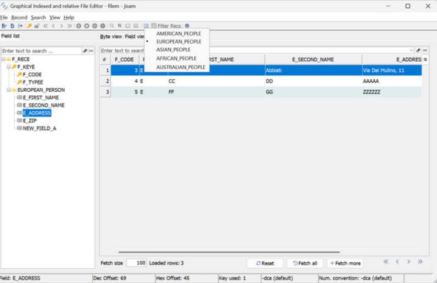
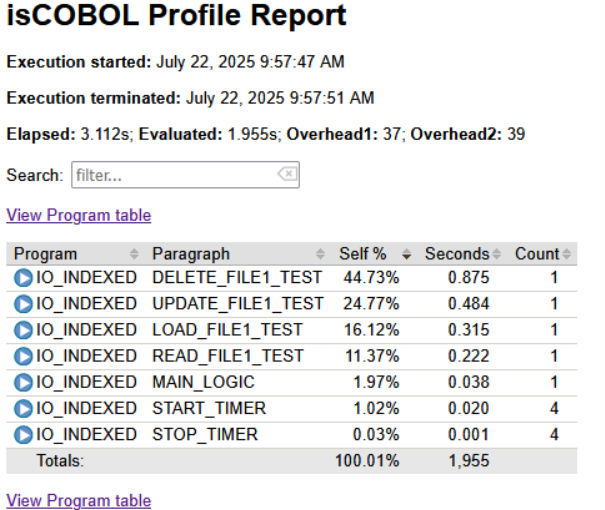
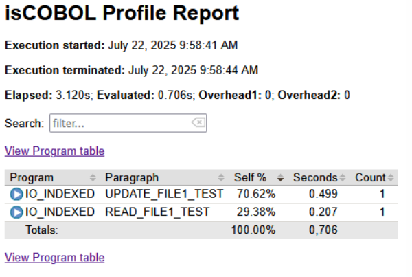

# isCOBOL Utilities

isCOBOL 2025 R2 has an enhanced GIFE utility that can filter records in multi table files, and the Profiler utility can now include or exclude specific programs or paragraphs from profiling.

## GIFE

The GIFE utility now provides improved support for conditions with TABLENAME syntax in the EFD WHEN directive. The GIFE toolbar provides a button that lists the table names. If the user selects an item from the list, the grid in the List view is filtered with the records that satisfy the conditions for that table. There is also a check-box named “Filter Recs” that can be toggled to activate the filter when navigating records in the Byte view or Field view.

For example, in the following file description:

```cobol
    fd  filem.
    >>EFD WHEN F_TYPE = "M" TABLENAME = AMERICAN_PEOPLE
    01  f-recM.
        ...
    >>EFD WHEN F_TYPE = "E" TABLENAME = EUROPEAN_PEOPLE
    01  f-recE.
        ...
    >>EFD WHEN F_TYPE = "S" TABLENAME = ASIAN_PEOPLE
    01  f-recS.
        ...
    >>EFD WHEN F_TYPE = "F" TABLENAME = AFRICAN_PEOPLE
    01  f-recF.
        ...
    >>EFD WHEN F_TYPE = "U" TABLENAME = AUSTRALIAN_PEOPLE
    01  f-recU.
        ...
```

the EFD WHEN directives are used to specify 5 different table names, and GIFE uses this information to filter records belonging to the specific table name. Figure 16, GIFE table names list, shows the record filter feature in use.

**Figure 16.** GIFE table names list.



In addition, the GIFE utility now supports command line options to supply settings for the iscobol.file.prefix and iscobol.gife.efd_directory settings.

For example, the following command:

```cobol
iscrun -c gife.properties -utility GIFE filem filem.xml
```

opens the file named filem using the dictionary file filem.xml using paths found in the configuration settings:

```cobol
iscobol.gife.efd_directory=/myapp/efd
iscobol.file.prefix=/myapp/custom_data:/myapp/common_data
...
```

## Profiler

The Profiler output might be rather complex as all the paragraphs of the profiled programs are profiled. In previous releases, settings allowed you to specify the programs to include or exclude in the profiling. Since version 2025 R2 it’s possible to reduce the list of profiled paragraphs using the includes and excludes settings and the syntax “::” in the iscobol.profiler.includes and iscobol.profiler.excludes configurations options.

For example of specifying a program to include, the following command executes the IO-PERFORMANCE sample by profiling only the IO-INDEXED subprogram; the other programs called by IO-PERFORMANCE (IO-LINESEQUENTIAL, IO-RELATIVE and IO-SEQUENTIAL) are not included in the profiler report:

```cobol
iscrun -c prof.properties -profile IO_PERFORMANCE
```
where the configuration file contains:

```cobol
iscobol.profiler.includes=IO_INDEXED
...
```

The above command produces a report as shown in Figure 17, *Profile all paragraphs*.

**Figure 17.** Profile all paragraphs.



Expanding on this example, the following command extends the previous one by profiling only the READ-FILE1-TEST paragraph and the UPDATE-FILE1-TEST paragraph of the IO-INDEXED program; the other paragraphs of IO-INDEXED are not included in the profiler:

```cobol
iscrun -c prof.properties -profile IO_PERFORMANCE
```

where the configuration file contains:

```cobol
iscobol.profiler.includes=IO_INDEXED::READ_FILE1_TEST,IO_INDEXED::UPDATE_FILE1_TEST
```

The above command produces a report as shown in Figure 18, *Profile specific paragraphs*.

**Figure 18.** Profile some paragraphs.



The reported elapsed time is the same as the previous report, but the evaluated time is lower, as it only includes specific paragraphs.
