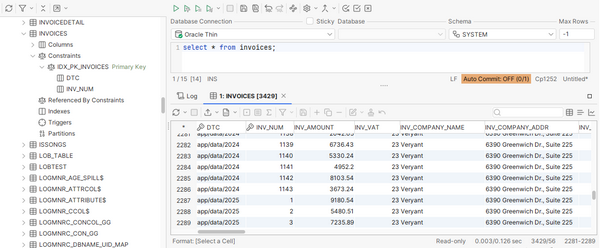

## Database Bridge

Database Bridge 2026 R1 offers two new properties that can be useful when migrating an application from ISAM files to Oracle RDBMS.

A traditional COBOL application that uses ISAM files may have the following directory structure:

- /app/data/2024/invoices.dat
- /app/data/2025/invoices.dat
- /app/data/2026/invoices.dat

This provides a clear separation of data across years. To carry this concept to an RDBMS environment, the Veryant Database Bridge can automatically create different table names, and you can specify what part of the folder structure to apply to the naming, using the iscobol.easydb.dirlevel runtime configuration property.

This property sets the number of path segments of the file name, starting from the bottom of the hierarchy and going to the top, to use when naming tables.

For example, by setting iscobol.easydb.dirlevel=1, the data of invoices.dat file in the /app/data/2024 folder is stored in a table named 2024invoices, the data of invoices.dat in /app/data/2025 is stored in a table named 2025invoices and the data of invoices.dat in /app/data/2026 is stored in a table named 2026invoices.

This solution is available for all the RDBMS supported by isCOBOL Database Bridge.

Starting from version 2026 R1, and only for the Oracle RDBMS, an alternative solution lets you store all data from the multiple invoices files in a single invoice table, and Database Bridge creates an additional varchar column called DTC , to store the folder information.

The DTC column is added at the beginning of the primary key and every index. This is achieved by setting two configuration properties:

- *iscobol.compiler.easydb.dirlevel_to_column=true* to enable the feature in the Oracle EDBI routines when the compiler generates the EDBI class
- *iscobol.easydb.dirlevel_to_column=n* to specify at runtime the number of path segments to store in the column

In the example above, using the following configuration settings

```cobol
iscobol.compiler.easydb.dirlevel_to_column=true
iscobol.easydb.dirlevel_to_column=3
```

Results in the creation of a table called “invoices” with the same structure of the ISAM file, and an additional column named DTC. All records of invoices.dat from /app/data/2024 will have “app/data/2024” as value of the DTC column, all records of invoices.dat from /app/data/2025 will have “app/data/2025” as value of the DTC column, and all records of invoices.dat from /app/data/2026 will have “app/data/2026” as value of the DTC column.

With this configuration, when using external programs that query the table through SQL, all data from the various files can be retrieved at once or filtered by specifying the desired values in the DTC column. Figure 22, *Invoices table with the DTC column*, below shows how data from different invoice files was stored in the same invoice table and the DTC column contains the path of the file that the COBOL application intended to use.

**Figure 22.** Invoices table with the DTC column


