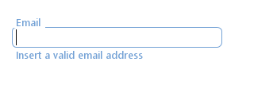
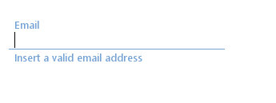
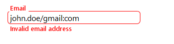
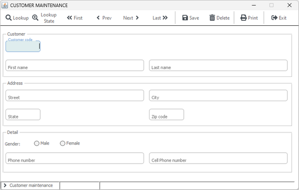
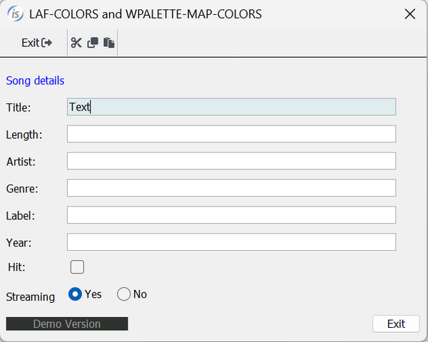
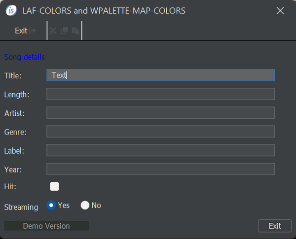
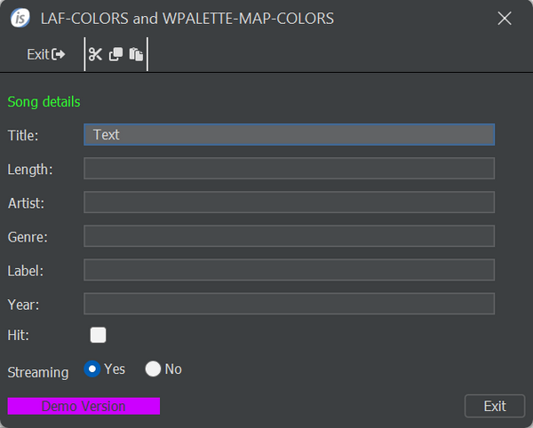
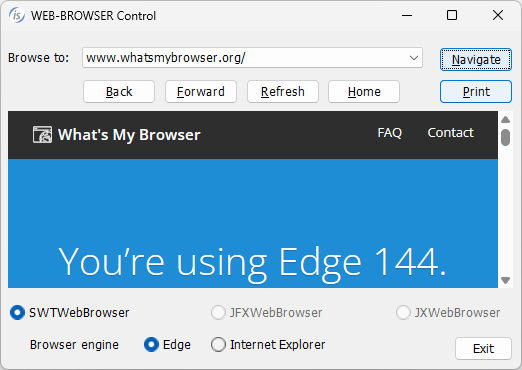

## GUI enhancements

isCOBOL Evolve 2026 R1 supports Google’s Material Design styles on entry-field controls, provides better integration with LAF used when running, and offers other graphical improvements.

### Entry-fields with Material Design

The new property MATERIAL-DESIGN allows you to give Entry-fields the Material Design style that is commonly used on web and mobile applications. It is not only a matter of appearance, but there are also specific runtime behaviors when the user interacts with these fields:

- When the field gets the focus, the border color changes, and the placeholder text becomes a floating label that moves above the field to make room for the content.
- When the field loses the focus, the floating label remains above the field if there’s content or changes back to placeholder text if there’s no content.

Fields with this style can also optionally show a small label below; this label is known as “supporting text”, commonly used to display hints or error messages.

There are four new properties for the Entry-Field control to configure the Material Design layout:

MATERIAL-DESIGN = 1 or 2 to specify the boxed or underlined field style

MD-LABEL to specify the placeholder text that will become the floating label

MD-RADIUS to specify the radius for the box corners

MD-SUPPORTING-TEXT to specify the text of the optional label that is shown below the field

The following snippet:

```cobol
       03 Ef-mail Entry-Field
             line 3, col 3, size 30
             height-in-cells, width-in-cells
             material-design 1
             md-label "Email"
             md-supporting-text "Insert a valid email address"
             md-radius 50.
```

generates a field as depicted in Figure 7, *Boxed material design field*.

**Figure 7.** Boxed material design field.



Changing the value of the material-design property from 1 to 2:

```cobol
       03 Ef-mail Entry-Field
             line 3, col 3, size 30
             height-in-cells, width-in-cells
             material-design 2
             md-label "Email"
             md-supporting-text "Insert a valid email address"
             md-radius 50.
```

the field will look like the one depicted in Figure 8, *Underlined material design field*.

**Figure 8.** Underlined material design field.



The new property MD-SUPPORTING-TEXT specifies text to be displayed below the Entry-fields when the Material Design style is applied. This text can be either always visible (if set in Screen Section or via MODIFY statement before accepting user input) to provide users with a hint on how to fill the field or can be shown later (via MODIFY statement after a user action) to report an error.

Both MD-LABEL and MD-SUPPORTING-TEXT use the Entry-Field border color for the text color.

If you’re using MD-SUPPORTING-TEXT to report an error, you might consider applying a red border color to the Entry-Field, making the label text red, as shown in the following code snippet:

```cobol
           perform check-email-address.
           if not email-is-valid
              modify Ef-mail border-color 13
                             md-supporting-text "Invalid email address"
           end-if.
```

The above code, when the IF condition is true, will make the Entry-Field appear as depicted in Figure 9, *Error reported via border color and supporting text*.

**Figure 9.** Error reported via border color and supporting text.



When using the material-design property on all fields, jyou can design GUIs that do not specify label controls, since the labels are automatically provided by the entry field. An example of such user interface is installed with the samples, in the modernization\\graphical\\5-material-design-gui folder.

The result is shown in Figure 10, *Modernization sample with material-design*.

**Figure 10.** Modernization sample with material-design.



### Better integration with LAF

The new style LAF-COLORS has been implemented on window, tool-bar and ribbon controls to simplify the management of colors for applications that wish to follow the default colors set by the Look and Feel.

Instead of calling the J$GETFROMLAF routine to retrieve the LAF background and foreground colors and then applying them in the DISPLAY WINDOW statement, you can now simply define the new style when creating the window. This ensures the window automatically uses the LAF colors, as shown in the following code snippet:

```cobol
           display standard window
                  laf-colors
                  ...
```

This style overrides any properties such as color, background-color, or foreground-color.

The style can be applied automatically to all windows across the application by adding the following compiler options and recompiling the source files:

```cobol
iscobol.compiler.gui.window.defaults=laf-colors
iscobol.compiler.gui.tool_bar.defaults=laf-colors
iscobol.compiler.gui.ribbon.defaults=laf-colors
```

When applications adopt different LAFs, colors assigned directly to controls (such as push‑buttons or entry‑fields) or to their elements (such as grid cells, rows, or tree‑view items) may need to be adjusted to better match the selected LAF, especially when using dark mode.

Two new op-codes have been implemented in the W$PALETTE library routine to help:

- WPALETTE-MAP-COLORS to map multiple RGB colors at once. With this function, all the colors used in the application can be remapped to different colors more suitable for the chosen LAF.
- WPALETTE-RESET-COLORS to reset all settings to the default values. With this function it’s easier to manage on-the-fly LAF changes, for example when switching from Light to Dark mode or vice versa.

By leveraging these two op-codes, the runtime can efficiently remap or restore palette definitions at run time, enabling centralized management of multiple Look and Feel (LAF) configurations. As a result, all LAF‑related logic is confined to the main program—or to the module responsible for LAF switching—eliminating the need to refactor individual source modules that apply interface color attributes.

The syntax of the new functions is shown in the following code snippet:

```cobol
          call "W$PALETTE" using wpalette-map-colors
                                 wpalette-original-colors
                                 wpalette-new-colors
          ...
          call "w$palette" using wpalette-reset-colors
```

The new parameters are defined in the updated copy file “ispalette.def” as shown below:

```cobol
          01  wpalette-original-colors.
              03  wpal-original-color occurs dynamic.
                  05  wpal-original-red                    pic x comp-x.
                  05  wpal-original-green                  pic x comp-x.
                  05  wpal-original-blue                   pic x comp-x.
          01  wpalette-new-colors.
              03  wpal-new-color occurs dynamic.
                  05  wpal-new-red                         pic x comp-x.
                  05  wpal-new-green                       pic x comp-x.
                  05  wpal-new-blue                        pic x comp-x.
```

Figure 11, *Colors used in Light mode*, shows an example of a window that displays two labels: one uses a blue text color, and another uses a gray text color on a black background, that are not optimal when using Dark mode, as shown in Figure 12, *Same colors used in Dark mode*. Also tool-bar icons that are dark gray in light mode are almost hidden in Dark mode. These issues can be solved easily using the new W$PALETTE op-codes and remapping the colors from blue to green, black to fuchsia and dark gray to white, as shown in Figure 13, *Remapped colors used in Dark mode*. This is how you can easily enable Dark mode in your gui application.

**Figure 11.** Colors used in Light mode.



**Figure 12.** Same colors used in Dark mode.



**Figure 13.** Remapped colors used in Dark mode.



In addition, colors and icons used by graphical messages created with DISPLAY MESSAGE BOX statement follow the defaults from the current Look and Feel. If the behavior of previous versions needs to be restored, you can set the configurationIn addition, colors and icons used by graphical messages created with DISPLAY MESSAGE BOX statement follow the defaults from the current Look and Feel. If the behavior of previous versions needs to be restored, you can set the configuration

```cobol
iscobol.gui.messagebox.native_style=false
```

### Other graphical improvements

Entry-field and combo-box controls have a new property named TRUNC-VALUE. This property can be used in INQUIRE statements to check if the content has been truncated because it’s too large to fit in the control’s width. This is especially useful when developing GUIs that support window resizing and need to adjust content to provide a responsive layout.

The following code snippet demonstrates one possible use case: if an entry-field content is truncated, the program sets the control hint to the full content, allowing users to hover over the control to view the entire value.

```cobol
           inquire ef-desc trunc-value in w-trunc
           if w-trunc = 1
             inquire ef-desc value in w-desc
             modify ef-desc hint w-desc
           end-if
```

BORDER-WIDTH and BORDER-COLOR properties are now supported in radio-button and check-box controls, as they have been supported by the PUSH-BUTTON control in previous releases. This is especially useful in controls that contain images that need to be underlined with the border.

These are new configurations options that have been implemented for GUI programs:

- *iscobol.gui.disabled_placeholder_color=n* to set the color of disabled controls when the placeholder is visible
- *iscobol.gui.secure_num_chars=n* to display a fixed number of characters in secure fields to increase the user privacy and security.
- *iscobol.gui.secure_char=x* to set a different character used in secure fields, with the default value being “\*”.

The default value of the configuration option iscobol.gui.webbrowser.class has been changed to “com.iscobol.browser.swt.SWTWebBrowser”. The previous browser implementation was based on the Microsoft Internet Explorer browser engine for Windows, and it has been deprecated in favor of the more modern Eclipse SWT Browser, based on Edge engine for Windows and WebKit2GTK for Unix.

If the COBOL application has been configured to use JavaFX’s WebView, it will continue to use it.

The figure 14, *New web-browser SWT*, shows the new implementation, loading a site that returns which kind of browser is used.

**Figure 14.** New web-browser SWT.


