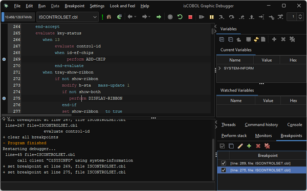

## Improved Debugger

IsCOBOL 2026 R1 debugger can now set breakpoints while the program is running.

With previous versions, and in many other COBOL debuggers, new breakpoints can only be set when programs are not running.

Starting from 2026 R1, the isCOBOL Debugger’s “Set breakpoint” menu items are always enabled, even when programs are running.

This new feature is particularly useful when running multiple programs, some compiled in debug mode and some are not. Even if a long‑running task is being executed in a program not compiled with debug information, the debugger still allows developers to set breakpoints without having to wait for a debug‑mode program to take control.

Breakpoints can also be set by clicking on the header column at the left of the source line or using the BREAK command in the command-line area.

The new feature is shown in Figure 15, *Breakpoints set in Debugger while program is running*, where two breakpoints are set on lines 269 and 275.

**Figure 15.** Breakpoints set in Debugger while program is running.

