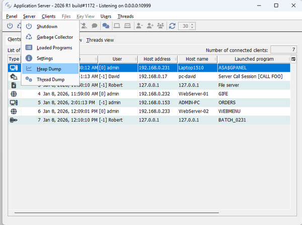

## Improved isCOBOL Server

IsCOBOL 2026 R1 can now generate thread dumps and heap dumps directly from the isCOBOL Server Panel.

The isCOBOL Server Panel includes two new menu items in the Server menu, along with two corresponding toolbar buttons. These features allow you to collect heap memory dumps and thread dumps directly from the Panel, without needing to attach the isCOBOL Server to external diagnostic tools such as VisualVM. The picture in Figure 16, *Panel dump features*, shows the new items in the Server menu.

**Figure 16.** Panel dump features

The dumps are generated on the server, in the isCOBOL Server’s working directory, and a message box will be displayed showing the full file name.
