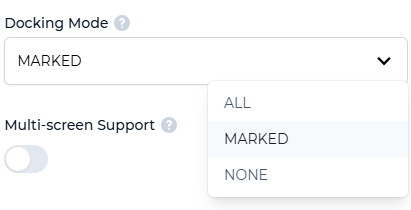
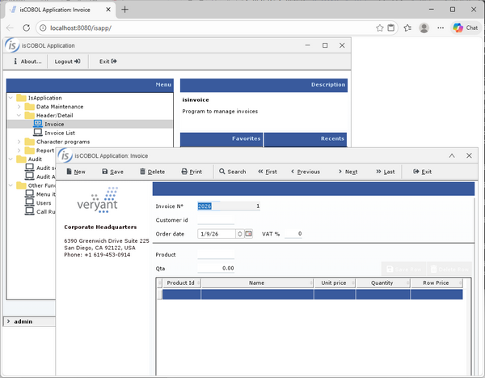
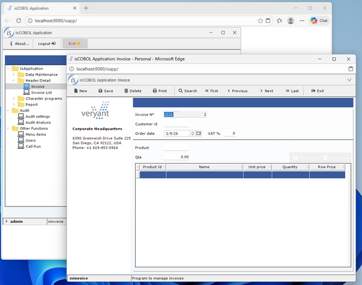
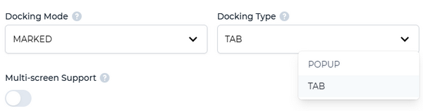
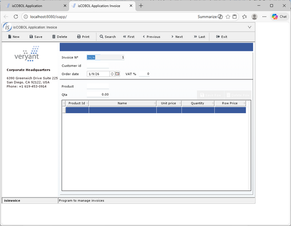

## IsCOBOL WebClient

IsCOBOL WebClient adds a new window style named IWC-DOCKABLE to mark windows as dockable in web environments.

WebClient lets users undock windows using a dedicated button on the window title bar that the user can click.

In previous releases, this setting affected all windows: they were either all dockable or all undockable. Now each window can be set to be dockable by using the new IWC-DOCKABLE style. The following snippet creates an independent window marked as dockable:

```cobol
           display independent graphical window
                   iwc-dockable
                   ...
```

Figure 17, *Docking mode setting*, shows the values available to the Docking Mode setting. When set to ALL, all windows are automatically dockable. When using MARKED, only windows that have new IWC-DOCKABLE will be dockable, and when set to NONE, no windows will be dockable, regardless of windows styles.

**Figure 17.** Docking Mode setting



Figure 18, *Undockable subwindow in WebClient*, and Figure 19, *Undocked subwindow in WebClient*, show two independent windows, a parent and child, where the child can be undocked, and the parent can’t. The second image shows how the child window appears after clicking the undock button on its title bar: it is moved in a separate browser window.

**Figure 18.** Undockable subwindow in WebClient.



**Figure 19.** Undocked subwindow in WebClient.



The default docking behavior is moving the window to a new browser window, but it can be configured in the Docking Type setting, and can be set to have the window moved to a separate tab of the same browser window, as depicted in Figure 20, *Docking Type Setting*.

**Figure 20.** Docking Type setting.



Figure 21, *Subwindow undocked into separate tab*, shows how the previous undocked window appears in a separate browser tab after changing the Docking Type setting.

**Figure 21.** Subwindow undocked into separate tab.


