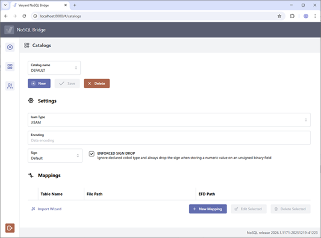
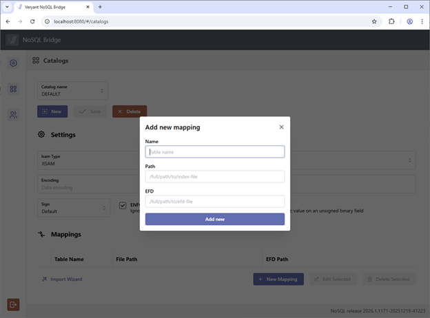
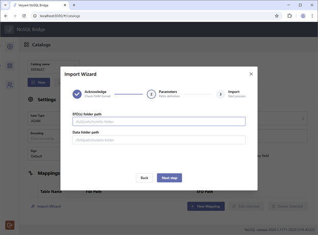
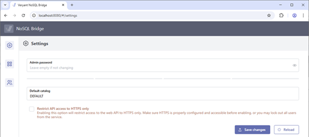
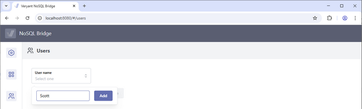
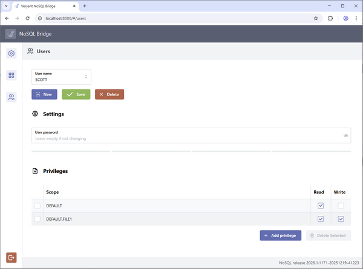

## NoSQL Bridge

NoSQL Bridge is a set of stateless REST API functions that provide access to indexed data files, supported by isCOBOL Evolve, through HTTP requests using JSON as a data format. This can ease the integration of third-party software with your database, without requiring you to write backend code.

The NoSQL Bridge product is available for installation on Windows with a dedicated MSI setup, and on Linux using the .tar.gz format. A separate license is required to use the product, and the license key must be configured in the iscobol.properties configuration file, as follows:

```cobol
iscobol.nosql.license.2026=xxx...
```

NoSQL Bridge embeds the isCOBOL runtime to access data file. It supports all indexed file formats and uses the EFD dictionaries (the XML files generated by the Compiler when using the -efd option) that describe the file structure.

NoSQL Bridge comes with a lightweight Jetty-based web server that can be started in the foreground mode with the nosqlc command or installed as a service with the nosql command. The following commands show the different ways it can be started:

```cobol
nosqlc
nosql –install
nosql -start
```

Alternatively, you can install the veryant-nsb.war library in any servlet container like Tomcat.

### Admin configuration

Once the web server is started and active, you can browse to http://server-IP:port to access the admin pages that let you configure users and datasets, as well as change the admin password.

After logging in as ‘admin’ with password ‘admin’, you land on the “Catalogs” configuration.

This user interface is depicted in Figure 1, *NoSQL Catalogs configuration*.

**Figure 1.** NoSQL Catalogs configuration.



A default catalog named DEFAULT is automatically created, but you can add additional catalogs by clicking the New button. In each catalog you can specify the indexed file handler (JISAM, VisionJ, etc, …), the character encoding and the sign convention. Then you must provide mappings between physical files and their dictionaries. For every mapping, you must specify: the logical name clients will use to identify the file, the file’s physical location, and the location of the EFD dictionary.

Mapping is depicted in Figure 2, *NoSQL New mapping*.

**Figure 2.** NoSQL New mapping.



The import wizard streamlines this process by allowing you to select the directories where data files and dictionaries are located. NoSQL Bridge automatically generates the mappings according to the contents of these directories, as shown in Figure 3, *NoSQL Mappings import wizard*.

**Figure 3.** NoSQL Mappings import wizard.



The administration portal offers two other pages that you can reach using the buttons on the left: Admin password change (depicted in Figure 4, *NoSQL Admin password*) and Users configuration. In the “Users” page you can define additional users, set the password, and set permissions on catalogs and mappings. Figure 5, *NoSQL New user*, depicts the creation of a new user and Figure 6, *NoSQL User permissions*, shows how the new user is given read-only access to each file in the DEFAULT catalog, except FILE1 where write permissions are also granted.

**Figure 4.** NoSQL Admin password.



**Figure 5.** NoSQL New user.



**Figure 6.** NoSQL User permissions.



### HTTP requests

HTTP requests can be performed with any HTTP client, such as Postman.

NoSQL Bridge accepts HTTP POST requests with a JSON body for parameters and returns JSON objects. Security is handled by Basic Authentication, where credentials are passed in the HTTP request headers. Refer to the documentation for the details on JSON format for requests and responses.

Here are a few examples of the protocol:

To get the description (file structure) of FILE1 mapped in the DEFAULT catalog, send the following request:

| | |
| --- | --- |
| URL: | http://server:port/DescribeTable |
| Body: | {  <br> "tableName": "FILE1" <br> } |
| | |

The following is the response:

```cobol
{
    "tableName": "FILE1",
    "readable": true,
    "writable": true,
    "tableDefinition": {
        "keys": {
            "F_REC_key0": {
                "paths": [
                    "F_REC.F_COD"
                ],
                "primary": true,
                "duplicates": false
            }
        },
        "recordDefinitions": {
            "F_REC": {
                "type": "object",
                "fieldDefinitions": {
                    "F_ADDRESS": {
                        "type": "string",
                        "length": 20
                    },
                    "F_BIRTHDAY": {
                        "type": "number",
                        "signed": false,
                        "truncation": true,
                        "signDrop": true,
                        "digits": 8
                    },
                    "F_COD": {
                        "type": "number",
                        "signed": false,
                        "truncation": true,
                        "signDrop": true,
                        "digits": 3
                    },
                    "F_FIRSTNAME": {
                        "type": "string",
                        "length": 20
                    },
                    "F_SECNAME": {
                        "type": "string",
                        "length": 20
                    }
                }
            }
        }
    }
}
```

To write a record to FILE1 on the TEST catalog, send the following request:

| | |
| --- | --- |
| URL: | http://server:port/PutItem |
| Body: | {  <br>"tableName": "DEFAULT.FILE1",  <br>"item": {    <br>"F_REC": {        <br>"F_COD": 1,        <br>"F_FIRSTNAME": "John",        <br>"F_SECNAME": "Doe",        <br>"F_ADDRESS": "20 Cooper Square, New York, NY 10003, USA"    <br>}  <br>}<br>} |
| | |

If the write operation is successful, the NoSQL Bridge returns a 200 HTTP response code, with no body.

The following are the functions currently supported by NoSQL Bridge:

- **DescribeTable**: returns the file structure, with the list of fields, their data types and the structure of keys.
- **GetItem**: returns the content of a single record (simulates READ KEY operation)
- **PutItem**: adds a new record or updates it if the key already exists (simulates WRITE INVALID REWRITE)
- **UpdateItem**: updates a record through expressions like SET field=value. Unlike the PutItem operation that required all fields to be specified, UpdateItems can accept a subset of fields
- **DeleteItem**: deletes a record
- **Query**: returns a list of records given search criteria (i.e. all records where the ID field is > 100)
